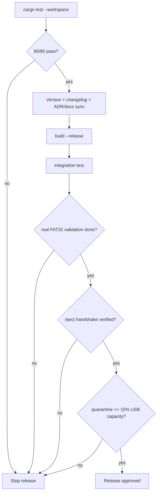

# Release Checklist

Use this checklist before handing off media/software deliverables.

## Release Gate Flow (Visual)

## Pre-Release Gates

1. [ ] All tests pass (`cargo test --workspace`) and baseline remains 80/80.
2. [ ] `Cargo.toml` version is updated for this release.
3. [ ] `README.md` reflects current CLI flags (`--sync`, `--json`, `--resume`).
4. [ ] Relevant ADRs are added/updated in `docs/adr/`.
5. [ ] `CHANGELOG.md` includes release notes for the shipped scope.
6. [ ] Checkpoint and recovery paths were validated on a real FAT32 removable USB.
7. [ ] No destructive behavior for untracked files (backup-first quarantine verified).
8. [ ] Physical ejection verified: `udisksctl power-off` or `eject` signal received before physical removal.
9. [ ] Quarantine quota verified: `.legacy_quarantine` does not exceed 10% of total USB capacity.
10. [ ] Governance taxonomy coverage reviewed (`R-01`, `R-02`, `R-05`, `R-06`, `R-08`, `R-09`, `R-10`, `R-15`, `R-20`, `R-25`) against `docs/spec/requirements_traceability.md`.
11. [ ] Every new requirement introduced in this release has an `R-CC-NNN` entry in `docs/spec/requirements_traceability.md` **before** any other document references it (see `docs/guides/requirements_workflow.md`).
12. [ ] `Current baseline` and `Last updated` fields in `requirements_traceability.md` header updated to this release version.
13. [ ] Every normative Rust function added/changed in this release has an `/// [R-CC-NNN]` implementation anchor with pre/post/invariant summary.
14. [ ] Any requirement promoted to `VERIFIED` is backed by an entry in `docs/testing/integration_tests.md`.
15. [ ] Any requirement in categories `R-02` or `R-05` promoted to `VERIFIED` is backed by negative/adversarial or fault-injected evidence, not only nominal-path tests.
16. [ ] If provisioning entrypoint/orchestration/progress flow changed, `R-01-006` and `R-01-007` entries were reviewed in `docs/spec/requirements_traceability.md` and implementation anchors remain current.
17. [ ] ADR-0012 (`docs/adr/0012-thin-entrypoint-orchestrator-reporter.md`) remains consistent with shipped architecture (thin `main`, orchestrator dispatch, reporter abstraction).

## Artifacts

1. [ ] Binary built with `cargo build --release`.
2. [ ] Integration suite run (`cargo test -p lap-core --test integration_test`).
3. [ ] Documentation index (`docs/README.md`) is in sync with current tree.
4. [ ] ADR status consistency validated (active/superseded ADRs aligned with current architecture and release scope).
