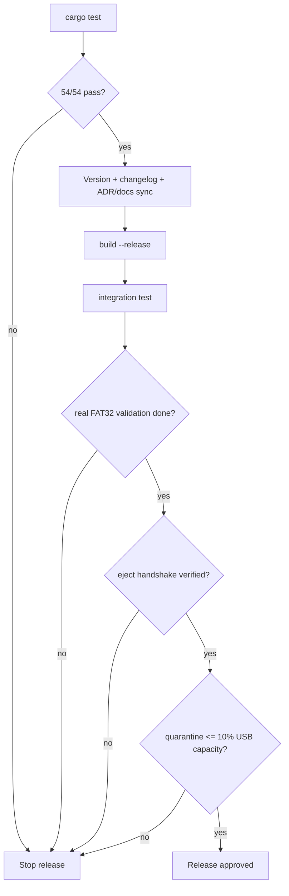

# Release Checklist

Use this checklist before handing off media/software deliverables.

## Release Gate Flow (Visual)

## Pre-Release Gates

1. [ ] All tests pass (`cargo test`) and baseline remains 54/54.
2. [ ] `Cargo.toml` version is updated for this release.
3. [ ] `README.md` reflects current CLI flags (`--sync`, `--json`, `--resume`).
4. [ ] Relevant ADRs are added/updated in `docs/adr/`.
5. [ ] `CHANGELOG.md` includes release notes for the shipped scope.
6. [ ] Checkpoint and recovery paths were validated on a real FAT32 removable USB.
7. [ ] No destructive behavior for untracked files (backup-first quarantine verified).
8. [ ] Physical ejection verified: `udisksctl power-off` or `eject` signal received before physical removal.
9. [ ] Quarantine quota verified: `.legacy_quarantine` does not exceed 10% of total USB capacity.

## Artifacts

1. [ ] Binary built with `cargo build --release`.
2. [ ] Integration suite run (`cargo test --test integration_test`).
3. [ ] Documentation index (`docs/README.md`) is in sync with current tree.
