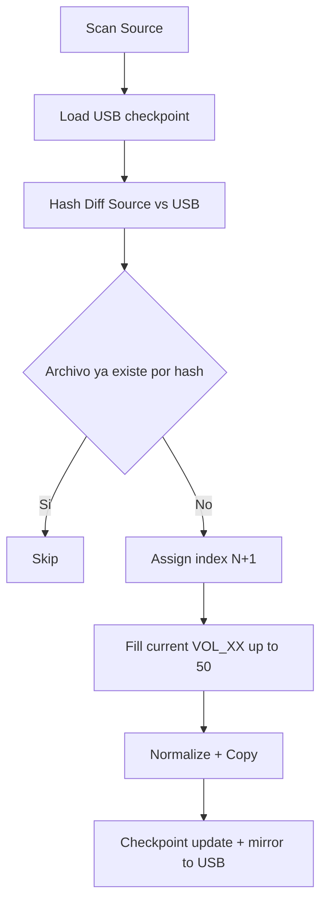

# Legacy Audio Provisioner (LAP)

Motor de gestión de archivos para USB legacy (estéreos ~2005), escrito en Rust.
No es un script de copia: es un FS-Manager con sincronización incremental, verificación criptográfica y hardening de hardware.

[](https://www.rust-lang.org/)
[]()
[]()

## Hardware Spec

| Constraint | Regla aplicada por LAP |
| --- | --- |
| Filesystem | Solo `vfat`/FAT32 |
| Removible | Validación contra `/sys/block/*/removable` |
| Topología | `ROOT -> VOL_XX -> archivo` (máx 2 niveles) |
| Capacidad por carpeta | Máx 50 archivos |
| Nombre de archivo | ASCII, máx 32 caracteres |
| Audio destino | MP3 CBR 128-192kbps |

## System Architecture

### 1. Sync Incremental (USB como fuente de verdad)

- `--sync` ejecuta diff SHA256 entre origen y USB.
- El checkpoint `.provisioning_checkpoint` también se espeja en la raíz de la USB.
- Se mantiene continuidad global de índices `N+1` y relleno de `VOL_XX` sin colisiones.



### 2. Seguridad de hardware y transaccionalidad

- Exclusión mutua por lock físico `.lap_provisioning.lock` (PID-based, orphan tolerant).
- Dirty-bit test (`assert_rw_filesystem`) antes de procesar para detectar `EROFS`/solo lectura.
- Detección de fraude NAND: aborto con `HARDWARE_FRAUD_DETECTED` tras 5 mismatches SHA256 consecutivos.
- Checkpoint atómico POSIX: `.tmp -> sync_all() -> rename()` + `dir sync`.

### 3. Normalización y sanitización estricta

- `normalizer.rs`:
  - passthrough seguro para MP3 CBR compatible,
  - transcodificación forzada a MP3 CBR 128k si no cumple,
  - limpieza agresiva (`-map 0:a:0`, `-map_metadata -1`) para evitar bloqueos por carátulas/tags.
- `sanitizer.rs`:
  - ASCII-only,
  - límite 32 chars,
  - preservación de extensión `.mp3` con truncamiento del stem (no rompe extensión).

### 4. Gestión de integridad por cuarentena

- Archivos `untracked` en USB no se borran por defecto.
- Flujo `backup-first`: primero copia a Host, luego aislamiento en `.legacy_quarantine/<session>/`.
- Resultado: USB limpia para el estéreo, sin riesgo de pérdida de datos del cliente.

## Safety First

LAP aplica protección multicapa para minimizar riesgo operativo:

1. Origen en host tratado como solo lectura.
2. Backup local en Host con verificación SHA256.
3. Aislamiento de huérfanos en `.legacy_quarantine/` en USB (no destructivo).

## Typed Errors + IPC

Los errores de dominio viven en `ProvisioningError` y se traducen a códigos estables para frontend/operación:

- `CONCURRENCY_ERROR`
- `FILESYSTEM_READ_ONLY`
- `ENOSPC_ERROR`
- `HARDWARE_FRAUD_DETECTED`
- `DRM_PROTECTED`
- `PROVISIONING_FAILED`

Eventos IPC JSON (`src/ipc.rs`) disponibles para UI:

- `PROGRESS`
- `WARNING`
- `FATAL_ERROR`
- `SUCCESS`

## CLI Usage

```bash
# Descubrir dispositivos válidos
legacy-audio-provisioner list

# Escanear audio en la primera USB detectada
legacy-audio-provisioner scan

# Simulación sin mutación
legacy-audio-provisioner \
  provision \
  --usb-mount /media/user/USB_TARGET \
  --audio-source ~/Music \
  --dry-run

# Provisión completa
legacy-audio-provisioner \
  provision \
  --usb-mount /media/user/USB_TARGET \
  --audio-source ~/Music

# Sincronización incremental
legacy-audio-provisioner \
  provision \
  --usb-mount /media/user/USB_TARGET \
  --audio-source ~/Music \
  --sync

# Eventos IPC JSON
legacy-audio-provisioner \
  --json \
  provision \
  --usb-mount /media/user/USB_TARGET \
  --audio-source ~/Music \
  --sync

# Reanudación tras fallo
legacy-audio-provisioner \
  resume \
  --usb-mount /media/user/USB_TARGET \
  --resume ~/usb_backup_20260315_1430
```

## Developer QA

Estado actual de calidad verificado:

- 41 unit tests
- 11 integration tests
- 2 doc tests
- Total: 54/54 passing

Runbook QA:

```bash
cargo test
cargo test --test integration_test
```

Cobertura relevante de Fase 2:

- diff incremental por hash
- cuarentena backup-first de huérfanos
- contrato IPC JSON
- errores tipados (`DRM_PROTECTED`, `FILESYSTEM_READ_ONLY`, `HARDWARE_FRAUD_DETECTED`, `ENOSPC_ERROR`)

## Documentation

- [Tech Spec](docs/tech_spec.md)
- [Design by Contract](docs/contracts/design_by_contract.md)
- [ADR History (Immutable, Canonical)](docs/adr/)
- [Legacy Architecture Notes (Context)](docs/architecture/)
- [Architectural Decisions](ARCHITECTURAL_DECISIONS.md)
- [ADR-0006 Docs Governance](docs/adr/0006-docs-as-code-governance.md)
- [Release Checklist](CHECKLIST.md)

## Build

```bash
cargo build --release
```

## License

MIT
