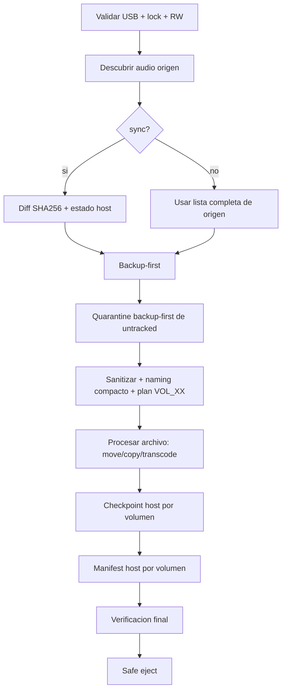
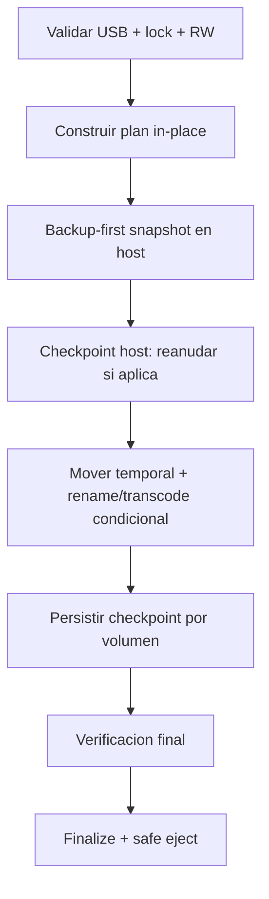

# Legacy Audio Provisioner (LAP)

Motor de provisión para USB legacy (estéreos antiguos), con enfoque en seguridad operativa:

1. Backup-first obligatorio antes de mutaciones.
2. Estado operativo en host segregado por dispositivo.
3. Verificación por hash y recuperación transaccional.

No es un script de copia simple: es un pipeline con validaciones de hardware, cuarentena de contenido no gestionado, checkpoint, normalización y verificación final.

[](https://www.rust-lang.org/)
[]()
[]()

## Tabla De Contenido

1. [Qué Hace LAP](#qué-hace-lap)
2. [Arquitectura Por Crates](#arquitectura-por-crates)
3. [Flujos De Ejecución](#flujos-de-ejecución)
4. [Artefactos Que Se Crean](#artefactos-que-se-crean)
5. [Comandos](#comandos)
6. [Runbook Recomendado](#runbook-recomendado)
7. [Modelo De Seguridad Operativa](#modelo-de-seguridad-operativa)
8. [Solución De Problemas](#solución-de-problemas)
9. [Desarrollo Y QA](#desarrollo-y-qa)

## Qué Hace LAP

Objetivo principal: preparar una USB para firmware legacy de audio bajo restricciones duras.

| Restricción de hardware | Regla aplicada por LAP |
| --- | --- |
| Filesystem | Solo `vfat`/FAT32 |
| Medio removible | Validación con `/sys/block/*/removable` |
| Topología de salida | `ROOT -> VOL_XX -> archivo` |
| Máximo por carpeta | 50 archivos |
| Nombre final | ASCII, `<= 32` bytes |
| Audio destino | MP3 compatible (según clasificador/normalizador) |

## Arquitectura Por Crates

Workspace actual:

1. `crates/lap-core`
- Núcleo de dominio.
- Módulos clave: backup, checkpoint, diffing, normalizer, sanitizer, verification, state, manifest, journal.

2. `crates/lap-bin-provision`
- CLI principal de operación (`list`, `scan`, `provision`, `format`, `resume`, `ingest`, `refactor`).
- Entry point delgado + orquestador.

3. `crates/lap-bin-ingest`
- Flujo de ingesta local/staging.

4. `crates/lap-cli-tools`
- Herramientas auxiliares.

## Flujos De Ejecución

### 1) Provision estándar



### 2) In-place rebuild



### 3) Principio operativo clave

El pipeline aplica el orden:

1. Backup primero.
2. Reestructuración/normalización después.
3. Acomodo final en USB al final.

## Artefactos Que Se Crean

### En host (estado operativo)

Por defecto se usa `~/.lap` (o `LAP_STATE_DIR` si está definido).

| Tipo | Ubicación |
| --- | --- |
| Backups | `~/.lap/backups/usb_backup_<device_key>/` |
| Checkpoint | `~/.lap/checkpoints/<device_key>/.provisioning_checkpoint` |
| Manifest dedupe | `~/.lap/manifests/manifest_<device_key>.json` |
| Journal transaccional | `~/.lap/journals/journal_<device_key>.json` |
| Logs de sesión | `~/.lap/logs/<session_id>/provisioning.log` |

### En USB

| Tipo | Ubicación |
| --- | --- |
| Lock operativo | `.lap_provisioning.lock` |
| Cuarentena | `.legacy_quarantine/<session>/` |
| Topología final | `VOL_01`, `VOL_02`, ... |

Nota importante:

1. El manifest operativo ya no se guarda en USB.
2. El checkpoint operativo ya no se espeja a USB.
3. El journal operativo ya no se guarda en USB.

## Comandos

Nota sobre sintaxis:

1. En `cargo run -p lap-bin-provision -- <comando>`, el `--` separa argumentos de `cargo` de argumentos de la aplicación.
2. `list`, `scan`, `provision`, etc. son subcomandos de `lap-bin-provision`, no flags.
3. Si prefieres evitar esa sintaxis, ejecuta el binario directo: `target/debug/lap-bin-provision <comando>`.

### Build

```bash
cargo build --workspace
cargo build --workspace --release
```

### Listar dispositivos

```bash
cargo run -p lap-bin-provision -- list
target/debug/lap-bin-provision list
```

### Escanear audio en USB

```bash
cargo run -p lap-bin-provision -- scan --usb /media/usuario/USB
target/debug/lap-bin-provision scan --usb /media/usuario/USB
```

### Dry-run seguro

```bash
cargo run -p lap-bin-provision -- \
  provision \
  --usb /media/usuario/USB \
  --source /home/usuario/Music \
  --dry-run

target/debug/lap-bin-provision \
  provision \
  --usb /media/usuario/USB \
  --source /home/usuario/Music \
  --dry-run
```

### Provision real

```bash
cargo run -p lap-bin-provision -- \
  provision \
  --usb /media/usuario/USB \
  --source /home/usuario/Music
```

### Sync incremental

```bash
cargo run -p lap-bin-provision -- \
  provision \
  --usb /media/usuario/USB \
  --source /home/usuario/Music \
  --sync
```

### In-place rebuild

```bash
cargo run -p lap-bin-provision -- \
  provision \
  --usb /media/usuario/USB \
  --source /media/usuario/USB \
  --in-place-rebuild
```

Nota operativa:

1. En la versión actual, `--source` sigue siendo obligatorio por contrato del CLI.
2. Con `--in-place-rebuild`, el entrypoint valida que `--source` y `--usb` resuelvan al mismo mount.
3. Si no coinciden, la ejecución falla con `INVALID_CONFIG`.

### JSON IPC para integración UI

```bash
cargo run -p lap-bin-provision -- \
  --json \
  provision \
  --usb /media/usuario/USB \
  --source /home/usuario/Music \
  --sync
```

### Reformateo seguro (con backup previo)

```bash
cargo run -p lap-bin-provision -- \
  format \
  --usb /media/usuario/USB \
  --confirm-device /dev/sdb1 \
  --label CABINA_A
```

### Reanudar sesión interrumpida

`--resume` espera un directorio que contiene `.provisioning_checkpoint`.

```bash
cargo run -p lap-bin-provision -- \
  resume \
  --usb /media/usuario/USB \
  --resume /ruta/al/directorio/de/checkpoint
```

### Ingest y refactor

```bash
cargo run -p lap-bin-provision -- ingest --usb /media/usuario/USB --source /ruta/staging
cargo run -p lap-bin-provision -- refactor --usb /media/usuario/USB --source /ruta/staging
```

## Runbook Recomendado

### Operación diaria (segura)

1. Ejecuta `list` y confirma el mount correcto.
2. Ejecuta `provision --dry-run`.
3. Revisa salida, tamaño y conteo.
4. Ejecuta `provision` real.
5. Confirma `SUCCESS` y eject seguro.

### Múltiples USB en paralelo operativo (sin contaminación de estado)

1. Cada USB obtiene su `device_key`.
2. Estado se separa automáticamente por `device_key` en `~/.lap`.
3. Puedes correr en distintas sesiones sin mezclar manifest/checkpoint/journal entre USB.

### Variable opcional para ubicar estado en otro disco

```bash
export LAP_STATE_DIR=/mnt/estado_lap
```

## Modelo De Seguridad Operativa

1. Source (`Music`) se trata como input, no como storage operativo.
2. Backup-first antes de mutar USB.
3. Quarantine backup-first para untracked.
4. Checkpoint atómico en host.
5. Verificación final antes de eject.

Errores tipados relevantes:

1. `CONCURRENCY_ERROR`
2. `FILESYSTEM_READ_ONLY`
3. `ENOSPC_ERROR`
4. `HARDWARE_FRAUD_DETECTED`
5. `DRM_PROTECTED`
6. `PROVISIONING_FAILED`
7. `INVALID_CONFIG`

## Solución De Problemas

### No encuentra `Cargo.toml`

Corre comandos desde la raíz del repo:

```bash
cd /ruta/legacy-audio-provisioner
```

### Lock stale en USB

Si el proceso anterior se interrumpió y no hay PID activo, elimina lock manualmente y reintenta:

```bash
rm -f /media/usuario/USB/.lap_provisioning.lock
```

### Disco host sin espacio para backup

LAP falla por diseño con `ENOSPC_ERROR`.
Libera espacio en el disco donde vive `~/.lap` o apunta `LAP_STATE_DIR` a otro volumen.

### `source` y `usb` inválidos

Se valida canonical path y se bloquean combinaciones peligrosas.
En `--in-place-rebuild` el origen debe ser el propio mount USB.

## Desarrollo Y QA

Comandos recomendados:

```bash
cargo build --workspace
cargo test -p lap-core --lib
cargo test -p lap-core --test integration_test
cargo test -p lap-bin-provision
cargo clippy -p lap-core -- -D warnings
```

## Documentación Relacionada

1. [docs/README.md](docs/README.md)
2. [docs/spec/tech_spec.md](docs/spec/tech_spec.md)
3. [docs/spec/requirements_traceability.md](docs/spec/requirements_traceability.md)
4. [docs/contracts/design_by_contract.md](docs/contracts/design_by_contract.md)
5. [docs/adr](docs/adr)
6. [CHECKLIST.md](CHECKLIST.md)

## Licencia

MIT
