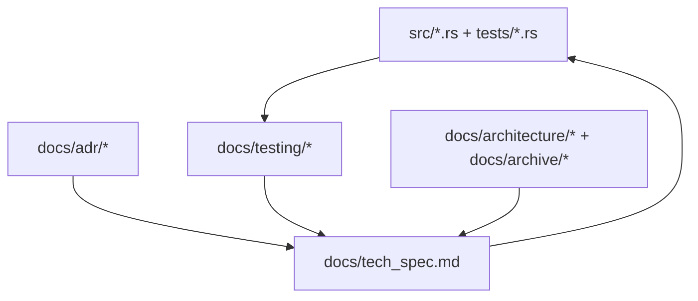

# Documentation Index

Este indice se mantiene por inventario de carpetas y nombres de archivo (no por menciones internas).

## Modelo Operativo (Docs-as-Code)

Fuente de verdad por tipo de documento:

- Decisiones arquitectonicas activas: `docs/adr/` (canonico).
- Especificacion tecnica de implementacion: `docs/tech_spec.md`.
- Evidencia de validacion: `docs/testing/`.
- Contexto historico/no normativo: `docs/architecture/` y `docs/archive/`.

### Mapa Visual

## Documentacion por Audiencia

| Audiencia | Documentos principales | Frecuencia esperada |
| --- | --- | --- |
| Operacion/Release | `README.md`, `CHECKLIST.md`, `CHANGELOG.md`, `RELEASE_NOTES.md` | Cada release |
| Desarrollo | `docs/tech_spec.md`, `docs/contracts/design_by_contract.md`, `docs/testing/*` | Cada cambio funcional |
| Arquitectura | `docs/adr/*` | Cada decision nueva/supercedida |
| Historico | `docs/architecture/*`, `docs/archive/*` | Solo cuando se archiva contexto |

## Estructura Canonica (`docs/`)

`docs/`
- `docs/tech_spec.md`
- `docs/README.md`

`docs/architecture/`
Notas legacy/no normativas de arquitectura (sin IDs ADR globales):
- `docs/architecture/architecture_overview.md`
- `docs/architecture/checkpoint_recovery.md`
- `docs/architecture/use-json-checkpoint-for-recovery.md`
- `docs/architecture/atomic-json-checkpoint.md`
- `docs/architecture/strict-hardware-validation.md`
- `docs/architecture/force-normalization-through-ffmpeg.md`
- `docs/architecture/normalization-destructive-ffmpeg.md`
- `docs/architecture/sync-before-unmount-and-poweroff.md`

`docs/adr/`
- `docs/adr/README.md`
- `docs/adr/0001-rust-project-structure.md`
- `docs/adr/0002-direct-file-copy.md`
- `docs/adr/0003-ffmpeg-normalization.md`
- `docs/adr/0004-quarantine-isolation.md`
- `docs/adr/0005-sync-sha256.md`
- `docs/adr/0006-docs-as-code-governance.md`

`docs/testing/`
- `docs/testing/integration_tests.md`
- `docs/testing/pbt_and_e2e_test_plan.md`

`docs/contracts/`
- `docs/contracts/design_by_contract.md`

`docs/guides/`
- `docs/guides/usage.md`
- `docs/guides/requirements_diagrams.md`

`docs/spec/`
- `docs/spec/spec_driven_development.md`
- `docs/spec/sdd_edge_cases_phase2.md`

`docs/archive/`
- `docs/archive/README.md`
- `docs/archive/AUDIT_MAIN_RS.md`
- `docs/archive/AUDIT_RESOLUTION_REPORT.md`
- `docs/archive/DEPENDENCIES_AUDIT.md`
- `docs/archive/GUIDE_SOFTWARE_DEVELOPMENT.md`
- `docs/archive/PROJECT_SUMMARY.md`

## Raiz Del Repositorio

Documentos activos en raiz:
- `README.md`
- `CONTRIBUTING.md`
- `ARCHITECTURAL_DECISIONS.md`
- `CHECKLIST.md`

No se mantienen stubs de compatibilidad en raiz.

Si se agrega o mueve un `.md`, este archivo debe actualizarse en el mismo cambio.

## Workflow Obligatorio

1. Cambiar codigo/tests.
2. Actualizar ADR/Spec/Testing docs afectadas en el mismo commit.
3. Ejecutar `cargo test`.
4. Validar que `docs/README.md` refleja el arbol real.
