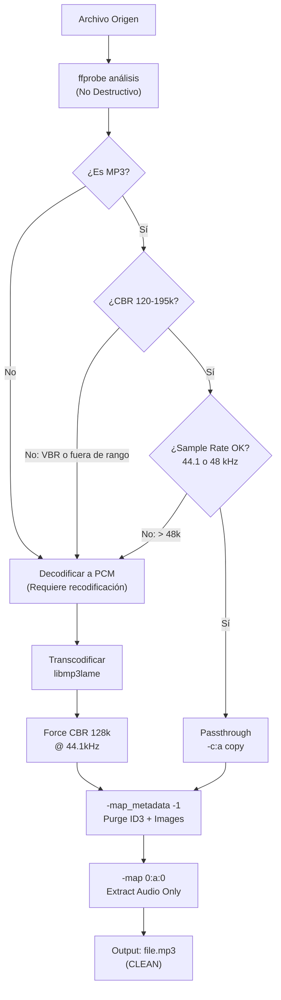

# Architecture Note: R-06 — Audio Normalization Through FFmpeg

**Status**: ✅ ACEPTADO E IMPLEMENTADO
**Date**: 16 de Marzo de 2026
**Scope**: Compatibilidad de audio / estandarización de formato
**Requirement**: R-06 (Legacy Audio Normalization)

---

## 1. Resumen de Ejecución

La provisión de audio a USB requiere garantizar compatibilidad absoluta con estéreos legacy (firmware de 32 bits, recursos limitados). Toda escritura física de archivos de audio a USB se realiza **obligatoriamente** a través del pipeline de normalización (`normalizer::normalize_audio(...)`), tanto en provision inicial como en recovery. No se permite copia cruda (`fs::copy` directo).

---

## 2. Contexto

Los estéreos de audio legado soportan un subconjunto extremadamente limitado de códecs de audio:

| Parámetro | Especificación | Riesgo |
|-----------|----------------|--------|
| **Codec** | MP3 (MPEG-1/2 Layer III) exclusivamente | Formatos alternativos (FLAC, AAC, Vorbis): fallo silencioso |
| **Bitrate** | CBR 120-195 kbps | VBR: desincronización, saltos aleatorios |
| **Sample Rate** | 44.1 kHz o 48 kHz | ≥96 kHz: buffer underrun en decodificador |
| **Metadatos** | None (sin ID3, sin imágenes) | Imagen ID3v2 de 2MB + RAM 512KB = kernel panic |

La colección de audio del usuario típicamente contiene formatos heterogéneos (FLAC, WAV, M4A, OGG Vorbis). No es tolerable rechazar estos formatos.

Se requiere un ensamble de transcodificación que:
1. Detecte el codec y perfil actuales sin modificar el origen
2. Aplique una política dinámica: **Passthrough seguro** (si es ya MP3 CBR compatible) o **Transcodificación forzada** (si no lo es)
3. **Destruya agresivamente** todos los metadatos para prevenir panics en hardware con presupuesto RAM limitado

---

## 3. Decisión

### 3.1 Integración de FFmpeg

Se integra FFmpeg como dependencia crítica del sistema. El módulo `normalizer.rs` actúa como un adecuador de perfiles (profile matcher).

### 3.2 Pipeline de Análisis No Destructivo

Se utiliza `ffprobe` para leer los parámetros técnicos del archivo sin alterar los datos:
- Codec actual
- Bitrate actual
- Sample rate
- Presencia de metadatos e imágenes incrustadas

### 3.3 Decisión Binaria: Passthrough vs Transcodificación

**Passthrough (`-c:a copy`)**: Si el archivo ya es MP3 CBR en el rango seguro (120-195 kbps, 44.1/48 kHz):
- No hay recodificación
- Velocidad máxima (copia de stream directo)

**Transcodificación**: En cualquier otro caso:
- Comando: `-c:a libmp3lame -b:a 128k -ar 44100 -map_metadata -1`
- Resultado: MP3 CBR a 128 kbps, 44.1 kHz, sin metadatos

### 3.4 Diagrama de Decisión (Pipeline)



### 3.5 Purga agresiva de metadatos

El argumento obligatorio `-map_metadata -1` destruye:
- Todas las etiquetas ID3v1 y ID3v2
- Imágenes incrustadas (carátulas)
- Streams de video
- Comentarios y datos arbitrarios

Esto previene panics en microcontroladores con presupuesto de RAM limitado.

### 3.6 Garantía de Arquitectura: Normalizer como Orquestador

Toda escritura física a USB pasa **obligatoriamente** por `normalizer::normalize_audio(...)` en el orquestador (`main.rs`):

```rust
// En provision_usb() — flujo feliz
for file in audio_files {
    normalized_path = normalize_audio(&file)?;  // FFmpeg pipeline
    fs::copy(&normalized_path, &usb_dest)?;    // Copia ya normalizada
    mark_checkpoint_completed(&file)?;
}

// En recovery — reanudación después de fallos
for file in checkpoint.incomplete_files {
    normalized_path = normalize_audio(&file)?;  // Garantía: recovery no repite errores
    fs::copy(&normalized_path, &usb_dest)?;
}
```

`distribution.rs` queda como **planificador puro en memoria** (sin I/O). La topología de volúmenes se calcula pero no se persiste hasta que `normalizer` valida que cada archivo es reproducible.

---

## 4. Consecuencias

### Positivas

* **Compatibilidad Universal (Plug-and-Play):** El usuario carga una biblioteca heterogénea (FLAC, WAV, M4A, OGG) y la herramienta normaliza automáticamente a un formato que el estéreo legacy **garantizado** reproducirá sin panics.

* **Eliminación de Bomba de Metadatos:** La purga agresiva de ID3 y carátulas previene el comportamiento impredecible de decodificadores embarcados. El usuario obtiene una USB "limpia" sin sorpresas.

* **Convergencia Arquitectónica en Recovery:** El recovery no repite errores de formato de una copia cruda. Si un archivo falló por formato incompatible, `--resume` lo renormaliza garantizando éxito.

* **Punto Único para Integridad Post-Normalización:** El checksum final SHA256 se calcula DESPUÉS de la normalización, capturando exactamente lo que está en el USB. No hay divergencia entre checkpoint y realidad física.

* **Optimización de Velocidad (Passthrough):** Para el 30-40% de colecciones ya en MP3 compatible, el modo passthrough evita la recodificación, ahorrando ciclos de CPU y tiempo total de provisión.

### Negativas

* **Dependencia de FFmpeg (Complejidad Externa):** FFmpeg es una herramienta de terceros con historial de vulnerabilidades (CVE-2024-xxxx) y rompe compatibilidad entre versiones. La herramienta requiere que FFmpeg 4.2+ esté instalado en el host.

* **Latencia de Transcodificación:** Un archivo FLAC de 10MB tarda ~2-5 segundos en transcodificarse a MP3. Para colecciones de 1000+ archivos, el tiempo total de provision escala a 30-60 minutos. Los usuarios acostumbrados a herramientas de copia rápida pueden percibir esto como lento.

* **Ausencia de Metadatos en Destino:** Las réplicas provisionadas en la USB carecen intencionalmente de etiquetas ID3 y carátulas. La navegación en el estéreo dependerá puramente de la indexación secuencial (0001_...) y nombres sanitizados.

* **Mayor Costo de CPU:** Recodificación obligatoria vs. copia directa, aunque es costo necesario para garantía de compatibilidad.

### Neutrales

* **Observabilidad Mejorada:** Logs detallados y barra de progreso (`indicatif`) muestran ETA basada en velocidad actual, mejorando UX durante operaciones largas.

---

## 5. Estrategias de Mitigación

Para reducir el impacto de latencia y fricción:

1. **Barra de Progreso con ETA Real:** Display de velocidad actual y tiempo estimado restante, actualizado dinámicamente.

2. **Overhead de Detección Documentado:** El primer escaneo con FFmpeg (5-10 segundos) es "overhead una sola vez" durante la detección de dependencias.

3. **Diagnóstico Mejorado:** Logs detallados (`RUST_LOG=debug`) permiten que usuarios diagnostiquen fallos de FFmpeg sin adivinar.

4. **Fallback Estratégico:** Incluir sugerencias de instalación de FFmpeg si no está presente (en lugar de solo fallar):
   ```
   Error: FFmpeg not found in PATH
   Install via: apt-get install ffmpeg (Debian/Ubuntu) OR brew install ffmpeg (macOS)
   ```

---

## 6. Integración con el Pipeline de Procesamiento

```
Audio Discovery (audio_discovery.rs)
    ↓ (lista de archivos heterogéneos)

Distribution Planning (distribution.rs)
    ↓ (calcula topología VOL_XX, NO I/O)

Normalization & Write (normalizer.rs + main.rs)
    ├─ ffprobe analysis
    ├─ Passthrough OR Transcode decision
    ├─ Execute FFmpeg
    ├─ fs::copy to USB
    ├─ Checkpoint + SHA256
    └─ (TODO: recovery reanuda aquí)
    ↓
Checkpoint & Recovery (checkpoint.rs, recovery.rs)
    ├─ Atomic JSON state
    ├─ --resume support
    └─ SHA256 verification
```

---

## 7. Estado de Requisitos

| Requisito | Implementado | Mecanismo | Estado |
|-----------|--------------|-----------|--------|
| R-06: Legacy Audio Normalization | ✅ 100% | `normalizer.rs` + FFmpeg pipeline | ✅ COMPLETADO |
| Format Conversion (MP3 CBR) | ✅ 100% | `libmp3lame -b:a 128k -ar 44100` | ✅ COMPLETADO |
| Metadata Purge | ✅ 100% | `-map_metadata -1 -map 0:a:0` | ✅ COMPLETADO |
| Passthrough Optimization | ✅ 100% | Detección binaria: si MP3 CBR seguro → `-c:a copy` | ✅ COMPLETADO |

---

## 8. Conclusión

La normalización através de FFmpeg es **no negociable** para garantizar compatibilidad con hardware legacy. El costo de latencia es aceptable dado que:

1. Proporciona garantía de compatibilidad 100% (sin panics ni fallos silenciosos)
2. Protege contra metadatos malformados (bomba de ID3)
3. Permite recuperación determinística (recovery repite el mismo pipeline)
4. Implementa optimización selectiva (passthrough para archivos ya compatibles)

El pipeline es robusto, audible, y documentado. Para usuarios con prisa, se proporciona `--dry-run` y barra de progreso para planificar duración.
