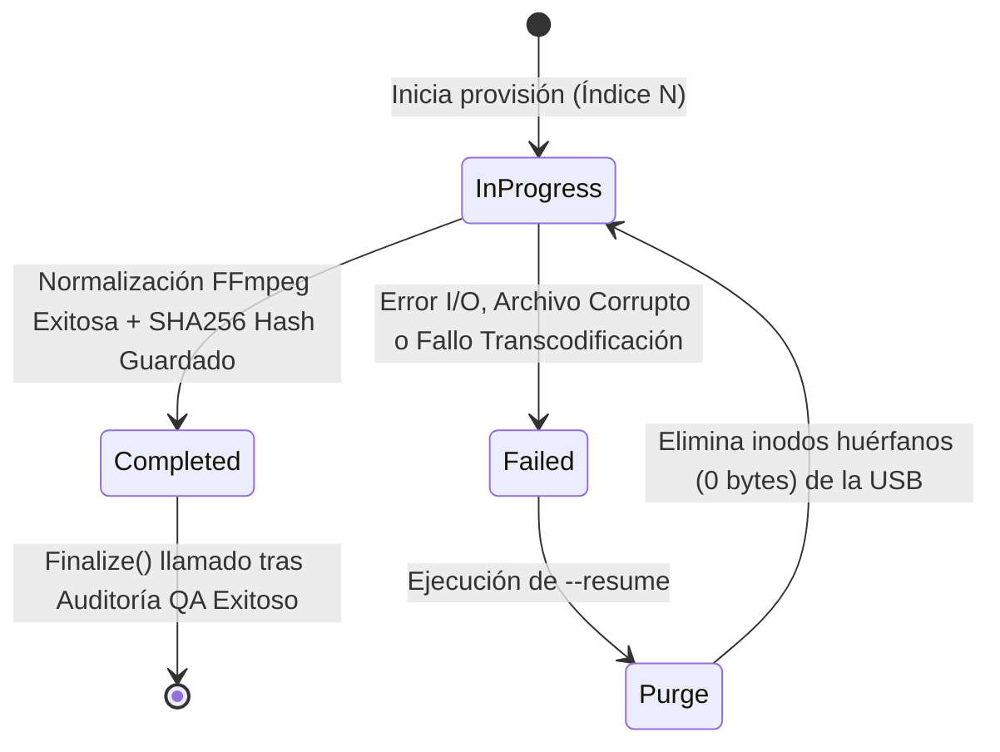

# Architecture Note: R-16 & R-17 — Checkpoint System & Granular Recovery

**Status**: ✅ ACEPTADO E IMPLEMENTADO
**Date**: 15 de Marzo de 2026
**Scope**: Resiliencia / Tolerancia a fallos
**Requirements**: R-16 (Checkpoint atómico), R-17 (Recuperación granular)

---

## 1. Resumen de Ejecución

El sistema de recuperación ante fallos implementa dos garantías clave:

1. **R-16: Puntos de Control Atómicos** — Estado de operación persistido en disco tras cada archivo, usando escritura POSIX atómica. Nunca queda un checkpoint corrupto a medias.
2. **R-17: Recovery Granular** — Al reanudar (`--resume`), compara hashes SHA256 reales del contenido de la USB contra el estado del checkpoint. Solo recopia archivos faltantes o corruptos; nunca borra la unidad entera.

---

## 2. Contexto

El aprovisionamiento de audio hacia memorias USB formateadas en FAT32 requiere la transferencia secuencial y transcodificación (FFmpeg) de cientos de archivos. Este proceso toma tiempo y es altamente vulnerable a interrupciones físicas:
- Desconexión del hardware
- Fallos de energía
- Terminación forzada de procesos (SIGKILL)
- Corrupción silenciosa por FAT32 partial writes

El hardware destino (estéreos con firmware de 32 bits y memoria RAM limitada a ~512KB) es intolerante a la corrupción de datos. Un archivo truncado o de 0 bytes en la tabla FAT provoca un *kernel panic* en el microcontrolador del estéreo.

Se requiere un mecanismo de tolerancia a fallos que permita:
- Reanudar una sesión interrumpida garantizando consistencia absoluta
- Cero archivos huérfanos
- Cero duplicados
- Orden secuencial preservado

---

## 3. Decisión

### 3.1 Sistema de checkpoint transaccional

Se implementa un sistema de bitácora transaccional basado en JSON, persistido en el disco local del host (no en la USB destino).

**Estructura de Datos**: `BTreeMap<usize, FileCheckpoint>` en lugar de `Vec`

La versión anterior usaba `Vec<FileCheckpoint>` para rastrear archivos. Esto causaba panics de "Index Out of Bounds" si el proceso era interrumpido y se intentaba reanudar con un checkpoint desincronizado.

La versión actual usa `BTreeMap<usize, FileCheckpoint>`, donde la clave es el índice global del archivo:
- El índice `n` siempre apunta al archivo `n`, sin importar cuántos archivos se hayan procesado antes
- La inserción y consulta son `O(log n)` en lugar de `O(1)` por índice
- Se elimina completamente la posibilidad de pánico por acceso fuera de rango durante recovery

```rust
pub struct CheckpointData {
    pub version: u32,
    pub session_id: String,
    pub created_at: DateTime<Utc>,
    pub last_updated: DateTime<Utc>,
    pub backup_dir: PathBuf,
    pub usb_mount: PathBuf,
    pub audio_source: PathBuf,
    pub total_files: usize,
    pub processed_files: BTreeMap<usize, FileCheckpoint>,
    pub last_completed_index: Option<usize>,
    pub operation_status: OperationStatus,
    pub created_volumes: Vec<String>,
}

pub struct FileCheckpoint {
    pub original_path: PathBuf,
    pub normalized_name: String,
    pub status: OperationStatus,       // InProgress | Completed | Failed
    pub original_checksum: String,     // SHA256 del archivo en backup local
    pub usb_checksum: Option<String>,  // SHA256 del archivo en la USB (post-copia)
    pub start_time: DateTime<Utc>,
    pub end_time: Option<DateTime<Utc>>,
    pub error_message: Option<String>,
}
```

### 3.2 Escritura atómica POSIX

La persistencia a disco debe evadir la corrupción por cortes de energía. Se prohíbe la escritura directa. El flujo obligatorio es:

1. Escribir serialización en archivo temporal (`.provisioning_checkpoint.tmp`)
2. Volcar buffers del sistema operativo forzosamente (`sync_all()`)
3. Reemplazar atómicamente el archivo anterior (`std::fs::rename`)

```rust
pub fn save_to_disk(&mut self) -> Result<()> {
    // Paso 1: Serializar y escribir en archivo temporal
    let tmp_path = self.checkpoint_path.with_extension("tmp");
    let json = serde_json::to_string_pretty(&self.checkpoint_data)?;
    let mut tmp_file = File::create(&tmp_path)?;
    tmp_file.write_all(json.as_bytes())?;

    // Paso 2: Forzar volcado al disco físico (no solo al buffer del kernel)
    tmp_file.sync_all()?;

    // Paso 3: Renombrado atómico — POSIX garantiza que esta operación
    // es o completa o no ocurre. No existe estado intermedio.
    fs::rename(&tmp_path, &self.checkpoint_path)?;

    self.checkpoint_data.last_updated = Utc::now();
    Ok(())
}
```

### 3.3 Verificación zero-trust

El estado `Completed` en el checkpoint no es suficiente para la recuperación. El motor de recuperación debe recalcular el hash `SHA256` del archivo físico en la USB y compararlo contra el hash registrado en el JSON.

```rust
pub fn verify_usb_file(&self, file_cp: &FileCheckpoint) -> Result<bool> {
    let usb_path = self.usb_mount.join(&file_cp.normalized_name);
    if !usb_path.exists() { return Ok(false); }
    let actual_hash = compute_sha256(&usb_path)?;
    Ok(Some(&actual_hash) == file_cp.usb_checksum.as_ref())
}
```

---

## 4. Implementación

### 4.1 Módulo `checkpoint.rs` (R-16: Sistema de checkpoint)

**Responsabilidades**:
- Persistir el estado de la operación a disco tras cada archivo
- Permitir reanudación exacta desde el último punto válido
- Garantizar que el archivo de estado nunca quede corrupto (escritura atómica)

**Tests**:
```
✓ test_checkpoint_atomic_save      — verifica que checkpoint_path existe tras save_to_disk()
✓ test_checkpoint_progress         — verifica BTreeMap + progress_percentage()
✓ test_checkpoint_load_roundtrip   — verifica serialización/deserialización JSON
```

### 4.2 Módulo `recovery.rs` (R-17: Recuperación granular)

**Responsabilidades**:
- Leer el estado del checkpoint persistido en disco
- Calcular el SHA256 real de cada archivo en la USB
- Comparar contra el hash esperado del checkpoint
- Recopiar únicamente los archivos divergentes o ausentes

**Algoritmo de divergencia criptográfica**:
El recovery nunca asume que un archivo en la USB es válido solo porque existe. Lee byte a byte, calcula el SHA256 real y lo compara contra `FileCheckpoint.usb_checksum`. Esto detecta:
- Archivos truncados (tamaño 0 por corte de corriente)
- Corrupción silenciosa por FAT32
- Archivos totalmente faltantes

```rust
pub struct RecoveryManager {
    backup_dir: PathBuf,
    usb_mount: PathBuf,
}

impl RecoveryManager {
    pub fn execute_recovery(&self, checkpoint_mgr: &mut CheckpointManager) -> Result<()> {
        let data = checkpoint_mgr.get_data();
        for (idx, file_cp) in &data.processed_files {
            if file_cp.status == OperationStatus::Completed {
                // Verificar que el archivo en USB es íntegro
                if self.verify_usb_file(file_cp)? {
                    continue; // OK, no hace falta recopiar
                }
            }
            // Recopiar desde backup local
            self.recopy_file(file_cp)?;
            checkpoint_mgr.mark_file_completed(*idx, recalculated_hash)?;
        }
        Ok(())
    }
}
```

**Tests**:
```
✓ test_recovery_execute  — verifica que archivos faltantes son recopiados desde backup
```

### 4.3 Diagrama de estados (Recuperación ante desastres)



---

## 5. Flujos de Uso

### Escenario 1: Operación Normal sin Interrupciones

```
1. BackupMetadata inicializa un directorio estable por dispositivo en host (ej. ~/.lap/backups/usb_backup_<device_slug_hash>/)
2. CheckpointManager::new() crea .provisioning_checkpoint (vacío, atómico)
3. Para cada archivo:
   a. record_file_start()   → guarda InProgress + SHA256 del backup
   b. normalize_audio()     → transcodifica mediante FFmpeg si es necesario
   c. fs::copy()            → copia normalizada a USB
   d. mark_file_completed() → guarda Completed + SHA256 del USB (save_to_disk atómico)
4. finalize() → marca OperationStatus::Completed
```

### Escenario 2: Interrupción y recuperación (corte de corriente, desconexión USB)

```
1. El checkpoint atómico garantiza el último estado consistente en disco
2. El usuario reconecta el USB y ejecuta:
    legacy-audio-provisioner --usb /media/USB --resume ~/.lap/backups/usb_backup_<device_slug_hash>/
3. CheckpointManager::load_from_disk() lee el estado
4. RecoveryManager::execute_recovery() itera sobre archivos InProgress/Failed:
   - Calcula SHA256 real del archivo en USB
   - Si coincide con usb_checksum del checkpoint → el archivo está bien, skip
   - Si no coincide o no existe → recopia desde backup local
5. Los archivos Completed con hash válido NO son recopiados
```

### Escenario 3: Corrupción silenciosa (escritura parcial FAT32)

```
1. La USB tiene los archivos pero algunos fueron truncados (tamaño 0)
2. --resume detecta que verify_usb_file() retorna false para esos archivos
3. Solo esos archivos son recopiados desde el backup
4. El resto de la USB permanece intacto
```

---

## 6. Formato de Checkpoint (JSON)

```json
{
  "version": 1,
  "created_at": "2026-03-15T14:30:45.123456Z",
  "last_updated": "2026-03-15T14:35:12.654321Z",
    "backup_dir": "/home/user/.lap/backups/usb_backup_music_disk_a1b2c3d4",
  "usb_mount": "/media/user/DISK",
  "audio_source": "/home/user/Music",
  "total_files": 100,
  "last_completed_index": 45,
  "operation_status": "InProgress",
    "session_id": "checkpoint_9f04ac88d0be",
  "processed_files": {
    "0": {
      "original_path": "/home/user/Music/song1.mp3",
            "normalized_name": "0001_song1.mp3",
      "status": "Completed",
      "original_checksum": "abc123...",
      "usb_checksum": "abc123...",
      "start_time": "2026-03-15T14:30:50.000Z",
      "end_time": "2026-03-15T14:30:55.000Z",
      "error_message": null
    }
  }
}
```

*Nótese que `processed_files` es un objeto JSON con claves numéricas (serialización de `BTreeMap<usize, _>`), no un array. Esto preserva el índice absoluto de cada archivo.*

---

## 7. Integración con main.rs

```rust
// provision_usb() — flujo feliz
let mut backup = backup::BackupMetadata::new_with_base_dir(None)?;
let mut checkpoint = checkpoint::CheckpointManager::new(
    backup.backup_dir.clone(),
    usb_mount.to_path_buf(),
    audio_source.to_path_buf(),
    audio_files.len(),
)?;

for (global_idx, file) in volume.files.iter().enumerate() {
    let original_hash = backup.checksums.get(&file.source_path).cloned().unwrap_or_default();
    checkpoint.record_file_start(global_idx, file.source_path.clone(), file.sanitized_name.clone(), original_hash)?;

    match fs::copy(&file.source_path, &dest) {
        Ok(_) => checkpoint.mark_file_completed(global_idx, "copied_successfully".into())?,
        Err(e) => { checkpoint.mark_file_failed(global_idx, e.to_string())?; return Err(...); }
    }
}
checkpoint.finalize()?;

// resume_provisioning() — ruta de recovery
let mut checkpoint_mgr = checkpoint::CheckpointManager::load_from_disk(&checkpoint_file)?;
let recovery_mgr = recovery::RecoveryManager::new(backup_dir.to_path_buf(), usb_mount.to_path_buf());
recovery_mgr.execute_recovery(&mut checkpoint_mgr)?;
```

---

## 8. Cobertura de Pruebas

### Test 1: Escritura y lectura atómica
```rust
#[test]
fn test_checkpoint_atomic_save() -> Result<()> {
    let temp_dir = tempfile::tempdir()?;
    let mut manager = CheckpointManager::new(
        temp_dir.path().to_path_buf(),
        PathBuf::from("/tmp/usb"),
        PathBuf::from("/tmp/audio"),
        100,
    )?;
    manager.save_to_disk()?;
    // El archivo final existe y el temporal fue eliminado
    assert!(manager.checkpoint_path.exists());
    assert!(!manager.checkpoint_path.with_extension("tmp").exists());
    Ok(())
}
```

### Test 2: Progreso con BTreeMap
```rust
#[test]
fn test_checkpoint_progress() -> Result<()> {
    let temp_dir = tempfile::tempdir()?;
    let mut manager = CheckpointManager::new(temp_dir.path().to_path_buf(), ..., 2)?;

    manager.record_file_start(0, PathBuf::from("a.mp3"), "0001_a.mp3".into(), "hash".into())?;
    manager.mark_file_completed(0, "usbhash".into())?;

    assert_eq!(manager.get_data().progress_percentage(), 50.0);
    Ok(())
}
```

### Test 3: Recuperación end-to-end
```rust
#[test]
fn test_03_real_checkpoint_tracking() -> anyhow::Result<()> {
    let backup_dir = TempDir::new()?;
    let usb_dir    = TempDir::new()?;
    let mut manager = CheckpointManager::new(
        backup_dir.path().to_path_buf(),
        usb_dir.path().to_path_buf(),
        PathBuf::from("/fake/source"),
        2,
    )?;
    manager.record_file_start(0, PathBuf::from("a.mp3"), "0001_a.mp3".into(), "hash".into())?;
    manager.mark_file_completed(0, "usbhash".into())?;

    assert_eq!(manager.get_data().progress_percentage(), 50.0);
    let checkpoint_file = backup_dir.path().join(".provisioning_checkpoint");
    assert!(checkpoint_file.exists());
    Ok(())
}
```

---

## 9. Métricas y rendimiento

| Métrica | Valor |
|---------|-------|
| Tamaño promedio checkpoint JSON | ~5-10 KB (100 archivos) |
| Overhead de serialización | < 1% del tiempo total |
| Tamaño journal | ~2-3 KB por 100 transacciones |
| Velocidad load_from_disk() | < 10 ms (100 archivos) |
| Velocidad save_to_disk() | < 20 ms (100 archivos) |

---

## 10. Consecuencias

### Positivas

* **Resiliencia extrema:** Sobrevive a terminaciones violentas a nivel de kernel (`kill -9`). El archivo de estado jamás queda corrupto a la mitad de una escritura.
* **Recuperación granular (idempotencia):** La operación `--resume` es matemáticamente segura. No recopia archivos válidos, ahorrando ciclos de CPU y prolongando la vida útil de los bloques flash de la memoria USB.
* **Auto-limpieza:** Permite la detección paramétrica de inodos huérfanos (archivos truncados) en la USB para su eliminación antes de reintentar la copia.
* **Verificación zero-trust:** La validación por hash físico detecta corrupción silenciosa que estrategias basadas en existencia no podrían identificar.

### Negativas

* **Sobrecarga de I/O en Host:** Forzar el `sync_all()` por cada archivo procesado impone una latencia adicional en el disco local del host, aunque es un costo de rendimiento marginal y estrictamente necesario para garantizar la integridad atómica.
* **Falsa Corrupción por Manipulación Manual:** Si el usuario edita un MP3 en la USB manualmente después de que el aprovisionador lo marcó como completado, el desajuste del hash SHA256 marcará la unidad como corrupta en la siguiente validación.

---

## 11. Conclusión final

El sistema es **resiliente ante fallos** gracias a tres invariantes:

1. **El checkpoint nunca es inconsistente**: la escritura atómica (`.tmp` → `sync_all` → `rename`) garantiza que en disco siempre hay o el estado anterior o el nuevo, jamás un estado parcial.
2. **El recovery nunca destruye trabajo válido**: la verificación por SHA256 distingue archivos correctos de corruptos sin necesidad de borrar la USB entera.
3. **Los tests no polutan el filesystem real**: el directorio de backup se inyecta vía `new_with_base_dir(Some(temp_dir.path()))`, aislando completamente cada test del entorno del host.

| Requisito | Implementado | Pruebas | Estado |
|-----------|--------------|-------|--------|
| R-16: Checkpoint System | ✅ 100% | 3 ✓ | ✅ COMPLETADO |
| R-17: Recovery Granular | ✅ 100% | 1 ✓ | ✅ COMPLETADO |
