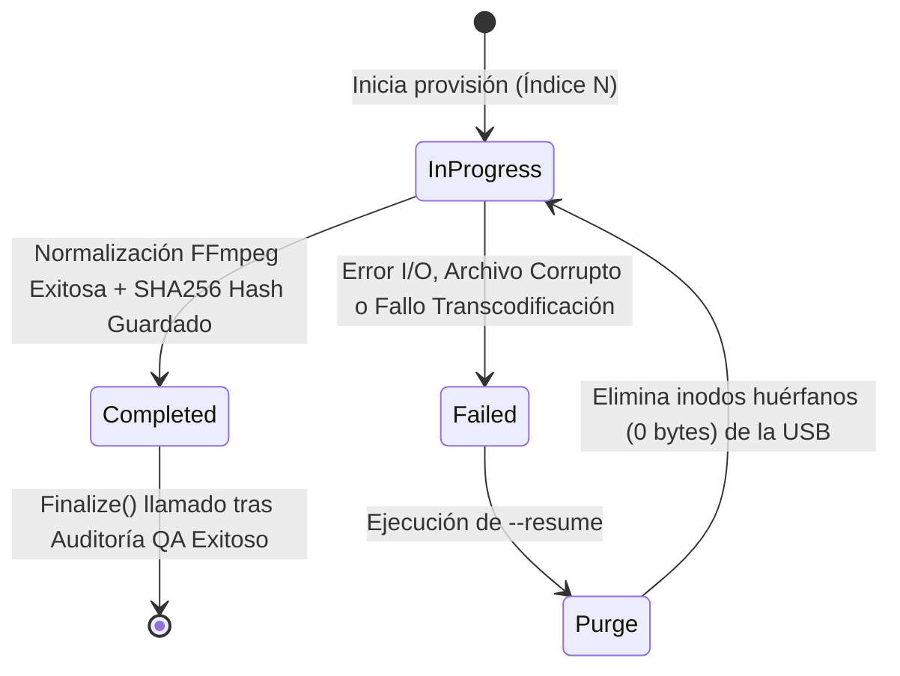

# Architecture Note: Sistema de Checkpoint Atomico en JSON para Disaster Recovery

## 1. Estado
Aceptado

## 2. Contexto
El aprovisionamiento de audio hacia memorias USB formateadas en FAT32 requiere la transferencia secuencial y transcodificación (FFmpeg) de cientos de archivos. Este proceso toma tiempo y es altamente vulnerable a interrupciones físicas (desconexión del hardware, fallos de energía o terminación forzada de procesos como `SIGKILL`).

El hardware destino (estéreos con firmware de 32 bits y memoria RAM limitada a ~512KB) es intolerante a la corrupción de datos. Un archivo truncado o de 0 bytes en la tabla FAT provoca un *kernel panic* en el microcontrolador del estéreo. Se requiere un mecanismo de tolerancia a fallos que permita reanudar una sesión interrumpida garantizando consistencia absoluta (cero archivos huérfanos, cero duplicados, orden secuencial preservado).

## 3. Decisión
Se implementa un sistema de bitácora transaccional (Checkpoint) basado en JSON, persistido en el disco local del host (no en la USB destino).

Las especificaciones estrictas de la implementación son:
1. **Estructura de Datos:** Uso de `BTreeMap<usize, FileCheckpoint>` en memoria para garantizar la iteración y persistencia en orden secuencial estricto, requisito ineludible para la escritura física en FAT32.
2. **Escritura Atómica POSIX:** La persistencia a disco debe evadir la corrupción por cortes de energía. Se prohíbe la escritura directa. El flujo obligatorio es:
   * Escribir serialización en un archivo temporal (`.provisioning_checkpoint.tmp`).
   * Volcar buffers del sistema operativo forzosamente (`sync_all()`).
   * Reemplazar atómicamente el archivo anterior (`std::fs::rename`).
3. **Verificación Zero-Trust:** El estado `Completed` en el checkpoint no es suficiente para la recuperación. El motor de recuperación debe recalcular el hash `SHA256` del archivo físico en la USB y compararlo contra el hash registrado en el JSON.

### Diagrama de Estados (Disaster Recovery)

## 4. Consecuencias

### Positivas

* **Resiliencia Extrema:** Sobrevive a terminaciones violentas a nivel de kernel (`kill -9`). El archivo de estado jamás queda corrupto a la mitad de una escritura.
* **Recuperación Granular (Idempotencia):** La operación `--resume` es matemáticamente segura. No recopia archivos válidos, ahorrando ciclos de CPU y prolongando la vida útil de los bloques flash de la memoria USB.
* **Auto-limpieza:** Permite la detección paramétrica de inodos huérfanos (archivos truncados) en la USB para su eliminación antes de reintentar la copia.

### Negativas

* **Sobrecarga de I/O en Host:** Forzar el `sync_all()` por cada archivo procesado impone un castigo de latencia en el disco local del host, aunque es un costo de rendimiento marginal y estrictamente necesario para garantizar la integridad atómica.
* **Falsa Corrupción por Manipulación Manual:** Si el usuario edita un MP3 en la USB manualmente después de que el aprovisionador lo marcó como completado, el desajuste del hash SHA256 marcará la unidad como corrupta en la siguiente validación.
