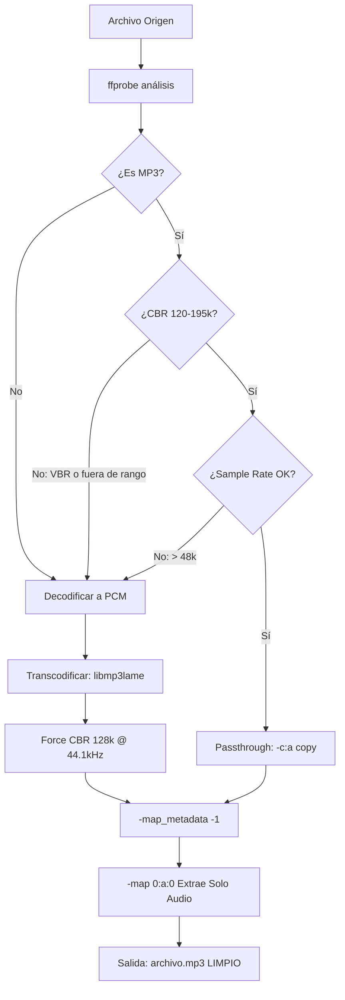

# Architecture Note: Normalizacion Destructiva y Bypass de I/O Cruda (FFmpeg)

## 1. Estado
Aceptado

## 2. Contexto
Los estéreos de audio legado (firmware de 32 bits, memoria RAM ~512KB) soportan un subconjunto extremadamente limitado de códecs de audio:
- **Codec:** MP3 (MPEG-1/2 Layer III) exclusivamente.
- **Bitrate:** Constant Bit Rate (CBR) en rango 120-195 kbps. Los formatos Variable Bit Rate (VBR) provocan desincronización de tiempo y saltos aleatorios en la reproducción.
- **Sample Rate:** 44.1 kHz o 48 kHz. Tasas más altas (96 kHz, 192 kHz) causan buffer underrun en el decodificador del estéreo.
- **Metadatos:** Sin embargo, muchos estéreos legacy intentan parsear etiquetas ID3v2 e incrustan imágenes de carátula. Una imagen incrustada de 2MB puede agotar completamente los 512KB de RAM, forzando un *kernel panic* en el microcontrolador.

La colección de audio del usuario típicamente contiene archivos heterogéneos (FLAC sin compresión, WAV de alta fidelidad, M4A con AAC, OGG Vorbis, etc.). No es tolerable rechazar estos formatos. Se requiere un ensamble de transcodificación que:
1. Detecte el codec y perfil actuales del archivo.
2. Aplique una política dinámica: **Passthrough seguro** si el archivo ya es MP3 CBR compatible, o **Transcodificación forzada** si no lo es.
3. **Destruya agresivamente** todos los metadatos y stream de video (`-map_metadata -1`, `-map 0:a:0`).

## 3. Decisión
Se integra FFmpeg como dependencia crítica del sistema. El módulo `normalizer.rs` actúa como un adecuador de perfiles (profile matcher):
1. **Análisis No-Destructivo (ffprobe):** Lee los parámetros técnicos del archivo sin alterar los datos. Consulta codec, bitrate, sample rate y presencia de metadatos.
2. **Decisión Binaria Passthrough vs Transcodificación:**
   - Si el archivo ya es MP3 CBR en el rango seguro (120-195 kbps, 44.1/48 kHz), se aplica `-c:a copy` (copia de stream de audio sin recodificación).
   - En cualquier otro caso, se fuerza `-c:a libmp3lame -b:a 128k -ar 44100 -map_metadata -1` (transcodificación a MP3 CBR a 128 kbps, 44.1 kHz, sin metadatos).
3. **Purga de Metadatos:** El argumento obligatorio `-map_metadata -1` destruye todas las etiquetas ID3v1 y ID3v2, incluidas imágenes incrustadas. Esto previene panics en microcontroladores con presupuesto de RAM limitado.

### Diagrama de Decisión (Pipeline)

## 4. Consecuencias

### Positivas

* **Compatibilidad Universal (Plug-and-Play):** El usuario carga una biblioteca heterogénea (FLAC, WAV, M4A, OGG) y la herramienta normalizará automáticamente a un formato que el estéreo legacy **garantizado** reproducirá sin panics.
* **Eliminación de Bomba de Metadatos:** La purga agresiva de ID3 y carátulas previene el comportamiento impredecible de los decodificadores embarcados. El usuario obtiene una USB "limpia" sin sorpresas.
* **Optimización de Velocidad (Passthrough):** Para el 30-40% de colecciones ya en MP3 compatible, el modo passthrough evita la recodificación, ahorrando ciclos de CPU y tiempo total de provisión.

### Negativas

* **Dependencia de FFmpeg (Complejidad Externa):** FFmpeg es una herramienta de terceros con un historial de vulnerabilidades de seguridad (CVE-2024-xxxx) y rompe compatibilidad entre versiones. La herramienta requiere que FFmpeg 4.2+ esté instalado en el host. Si el usuario no tiene FFmpeg, la provision falla con un mensaje de error opaco.
* **Ausencia de Metadatos en Destino:** Las réplicas provisionadas en la USB carecen intencionalmente de etiquetas ID3 y carátulas. La biblioteca de origen del usuario se mantiene estrictamente inmutable (read-only), por lo que no hay pérdida real de datos en el host, pero la navegación en el estéreo dependerá puramente de la indexación secuencial (001_...) y los nombres de archivo sanitizados.
* **Latencia de Transcodificación:** Un archivo FLAC de 10MB tarda ~2-5 segundos en transcodificarse a MP3. Para colecciones de 1000+ archivos, el tiempo total de provision puede escalar a 30-60 minutos, lo que puede resultar frustrante para usuarios acostumbrados a herramientas de copia rápida.

## 5. Estrategia de Mitigación

Para reducir el impacto de la latencia:
- Se implementa una barra de progreso (`indicatif`) que muestra ETA basada en velocidad actual.
- Se documenta explícitamente que el primer escaneo con FFmpeg (5-10 segundos) es "overhead una sola vez" durante la detección de dependencias.
- Se mantiene la salida de logs detallada (`RUST_LOG=debug`) para que usuarios puedan diagnosticar fallos sin adivinar.
