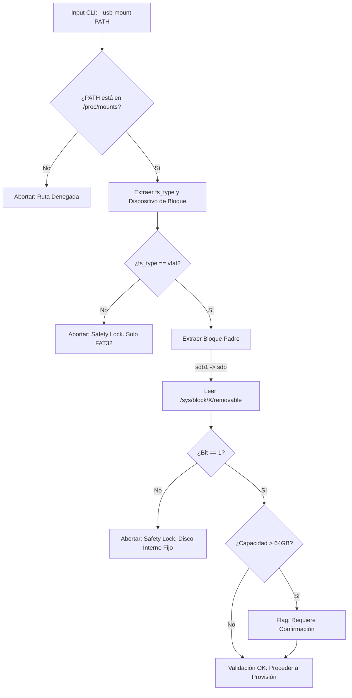

# Architecture Note: Validacion Estricta de Hardware y Prevencion de Destruccion de Sistema

## 1. Estado
Aceptado

## 2. Contexto
La herramienta `legacy-audio-provisioner` ejecuta operaciones de I/O masivas y destructivas (borrado de inodos huérfanos, normalización y escritura directa) sobre el directorio de destino proporcionado en la CLI (`--usb-mount`).

Si un usuario comete un error tipográfico o asigna por accidente un directorio local (ej. `/home/user/musica` o `/dev/sda1`), una validación laxa asumiría que la ruta es válida simplemente porque existe. Esto provocaría la sobrescritura y potencial destrucción de datos en el disco duro principal del sistema operativo host. Se requiere un mecanismo de confianza cero (Zero-Trust) que rechace cualquier ruta que no pertenezca inequívocamente a un medio de almacenamiento extraíble formateado para hardware *legacy*.

## 3. Decisión
Se descarta cualquier heurística basada en nombres de carpetas o suposiciones de alto nivel. La validación de hardware se acopla estrictamente a la API expuesta por el kernel de Linux a través de sus sistemas de archivos virtuales (`/proc` y `/sys`).

El módulo `hardware.rs` implementa una "Doble Cerradura" ineludible:
1. **Verificación de Topología en Memoria (`/proc/mounts`):** La ruta inyectada por el usuario debe coincidir exactamente con un punto de montaje activo de un dispositivo de bloque (excluyendo `/dev/loop` y pseudo-filesystems). El sistema de archivos reportado debe ser estrictamente `vfat` o `fat32`.
2. **Lectura del Descriptor SCSI/USB (`/sys/block/X/removable`):** El sistema extrae el bloque padre de la partición (resolviendo nomenclaturas SATA `sdb1 -> sdb` y MMC `mmcblk0p1 -> mmcblk0`). Luego, lee el bit de hardware directamente del kernel. Si el bit no es `1`, la ejecución aborta inmediatamente con un `Hardware Safety Lock`.

### Diagrama de Flujo (Política de Rechazo)

## 4. Consecuencias

### Positivas

* **Inmunidad a Errores de Usuario (Fail-Safe):** Es estructuralmente imposible que la herramienta mutile el disco `ext4`, `btrfs` o `nvme` del sistema operativo, garantizando la seguridad del host.
* **Soporte de Hardware Extendido:** El parseo robusto del bloque padre asegura compatibilidad inmediata con adaptadores SD a USB (`mmcblk`), comunes en entornos de audio de vehículos.

### Negativas

* **Acoplamiento al SO (Vendor Lock-in):** Esta decisión ata el módulo `hardware.rs` de manera absoluta a la arquitectura del kernel de Linux. La portabilidad futura a macOS o Windows exigirá una reescritura completa de este módulo utilizando llamadas a la API de IOKit (macOS) o Win32 (Windows), gestionadas a través de atributos de compilación condicional (`#[cfg(target_os = "...")]`).
