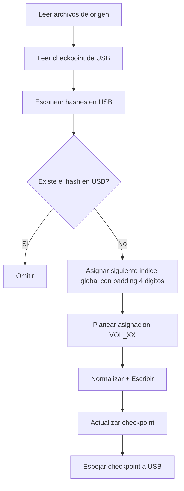

# Decisiones Operativas (AD-XX)

Documento de decisiones técnicas de alto nivel para la Fase 2 del motor.
Complementa los ADRs canonicos en `docs/adr/` con foco operativo en Sync, integridad y tolerancia a fallos.

Gobernanza documental activa: ver `docs/adr/0006-docs-as-code-governance.md`.

---

## AD-01: USB como Fuente de Verdad en modo `--sync`

- **Decisión**: usar diff SHA256 entre `audio-source` y USB para procesar solo novedades.
- **Estado persistente**: `.provisioning_checkpoint` espejado también en raíz USB.
- **Justificación**:
  - evita reprocesamiento masivo,
  - preserva continuidad de índices globales `N+1`,
  - permite operación incremental sobre USB ya pobladas.
- **Consecuencia**:
  - cómputo de hash adicional durante diff,
  - menor CPU total al evitar transcodificar duplicados.

---

## AD-02: Continuidad de índices y topología FAT32

- **Decisión**: mantener numeración global continua y ocupación por volumen (`VOL_XX`, máx 50 archivos).
- **Regla**:
  - calcular `max_existing_index` en USB/checkpoint,
  - comenzar nuevos archivos desde `max + 1`,
  - escribir nuevos nombres con prefijo de 4 digitos (`{:04}`),
  - aceptar lectura de prefijos `\d{3}` y `\d{4}` en modo transición,
  - rellenar último volumen parcial antes de abrir uno nuevo.
- **Justificación**:
  - previene colisiones de nombres,
  - mantiene orden reproducible para firmwares que leen por orden FAT,
  - evita quiebre de orden al superar 999 archivos (`0999` -> `1000`).

- **Validación de transición**:
  - si se detecta mezcla de prefijos 3/4 dígitos en la USB, emitir advertencia operativa,
  - recomendar normalización/reindexación completa a 4 dígitos para evitar saltos de orden en estéreos legacy.

---

## AD-03: Transaccionalidad y seguridad de hardware (Zero-Trust)

- **Decisión**:
  - lock físico `.lap_provisioning.lock` para exclusión mutua,
  - dirty-bit test (`assert_rw_filesystem`) antes de I/O,
  - checkpoint atómico POSIX (`tmp -> sync_all -> rename + dir sync`).
- **Justificación**:
  - evitar corrupción por concurrencia y dispositivos en modo read-only,
  - garantizar recuperabilidad tras cortes abruptos.

---

## AD-04: Detección de fraude NAND por anomalía criptográfica

- **Decisión**: abortar proceso con `HARDWARE_FRAUD_DETECTED` tras 5 mismatches SHA256 consecutivos en validación final.
- **Justificación**:
  - dispositivos con capacidad falsificada sobreescriben bloques y aparentan éxito de escritura,
  - la señal de mismatches consecutivos es un indicador operativo fuerte de spoofing.

---

## AD-05: Normalización destructiva para compatibilidad legacy

- **Decisión**:
  - passthrough de MP3 seguro,
  - transcodificación forzada a MP3 CBR 128k cuando no cumple perfil,
  - limpieza estricta de streams/metadatos (`-map 0:a:0`, `-map_metadata -1`).
- **Justificación**:
  - firmware legacy falla con VBR, tags complejos y carátulas embebidas.

---

## AD-06: Sanitización determinista con preservación de extensión

- **Decisión**:
  - aplicar transliteración ASCII,
  - limpiar ruido inicial/final por Regex compiladas con `OnceLock` (incluyendo `AUDIOMOVIL` case-insensitive en bordes),
  - normalizar separadores a `_`,
  - limitar stem intermedio a 64 caracteres,
  - y garantizar nombre final legacy `<= 32` en USB con prefijo secuencial/extensión final.
- **Justificación**:
  - evita archivos ilegibles por firmware,
  - elimina el bug de truncamiento que rompía la extensión.

---

## AD-10: Expulsión segura opt-in al final de provisión

- **Decisión**:
  - mantener la USB montada por defecto al finalizar (`provision` y `in-place-rebuild`),
  - habilitar expulsión segura automática solo cuando `LAP_SAFE_EJECT=1`.
- **Justificación**:
  - mejora verificabilidad y visibilidad para el usuario al terminar,
  - evita confusión operativa por desmontaje/power-off inmediato,
  - conserva opción de seguridad estricta cuando se requiere extracción inmediata.

---

## AD-11: Inversión del pipeline de protección de nombres

- **Decisión**:
  - ejecutar sanitización/truncado antes de validaciones de seguridad sobre nombre final,
  - evaluar el filtro defensivo sólo sobre datos normalizados.
- **Justificación**:
  - reduce falsos positivos por entradas "sucias" no canónicas,
  - preserva señales reales de riesgo sin bloquear casos válidos.

---

## AD-12: Streaming incremental como política de memoria

- **Decisión**:
  - evitar materialización eager del source completo en sync incremental,
  - recorrer source en streaming para comparar contra índice hash objetivo.
- **Justificación**:
  - uso de RAM acotado y estable en colecciones grandes,
  - mejor latencia percibida en telemetría/progreso.

---

## AD-13: Sanitización inteligente no destructiva

- **Decisión**:
  - transliteración ASCII en lugar de borrado ciego de UTF-8,
  - poda de junk por regex (`+++`, `0000`, tags promocionales),
  - normalización de separadores y colapso de runs a `_`.
- **Justificación**:
  - nombres legibles para usuario,
  - compatibilidad FAT32 sin pérdida innecesaria de semántica.

---

## AD-14: Idempotencia y source-of-truth por hash en sync

- **Decisión**:
  - identidad incremental por hash8 embebido en nombre legacy,
  - omitir (`SKIP`) contenido ya presente por hash aunque cambie ubicación,
  - impedir doble prefijo/doble saneamiento sobre nombres ya procesados.
- **Justificación**:
  - elimina duplicados por reprocesamiento,
  - garantiza convergencia entre corridas repetidas.

---

## AD-15: Escalabilidad de prefijo global a 4 dígitos

- **Decisión**:
  - escritura nueva en formato `NNNN_` (`{:04}`),
  - continuidad desde high-water mark detectado en USB,
  - compatibilidad temporal de lectura para `\d{3}` y `\d{4}`.
- **Justificación**:
  - evita quiebre de orden lexicográfico al superar 999 archivos,
  - habilita transición sin migración forzosa inmediata.

---

## AD-16: Topología `VOL_XX` con índice global canónico

- **Decisión**:
  - mantener agrupación por volúmenes para límites FAT32,
  - usar el índice global en nombre como orden final de reproducción.
- **Justificación**:
  - respeta restricciones de firmware legacy por carpeta,
  - conserva orden reproducible entre volúmenes.

---

## AD-07: Politica no destructiva para `untracked` (Cuarentena)

- **Decisión**:
  - no borrar por defecto archivos huérfanos,
  - aplicar aislamiento `backup-first` hacia `.legacy_quarantine/<session>/`.
- **Justificación**:
  - minimiza riesgo contractual de pérdida de datos del cliente,
  - deja USB operativa para estéreo sin descartar evidencia ni contenido.
- **Flujo**:
  1. Backup en host.
  2. Mover a cuarentena oculta en USB.
  3. Sincronizar directorios.

---

## AD-08: Contrato de errores tipados e IPC para frontend

- **Decisión**:
  - centralizar fallos de dominio en `ProvisioningError`,
  - mapear eventos operativos a JSON IPC (`PROGRESS`, `WARNING`, `FATAL_ERROR`, `SUCCESS`).
- **Justificación**:
  - frontera estable backend/frontend,
  - mayor observabilidad y automatización de remediación en UI.

---

## AD-09: EntryPoint delgada + reporter desacoplado + hash centralizado

- **Decisión**:
  - mantener `main` como entrypoint delgado (bootstrap + dispatch),
  - ejecutar flujo de negocio en `ProvisioningOrchestrator`,
  - reportar progreso vía trait `ProgressReporter` (CLI/JSON),
  - centralizar SHA256 en `lap-core::crypto::compute_file_sha256`.
- **Justificación**:
  - reduce acoplamiento y complejidad ciclomática del binario,
  - mejora mantenibilidad y pruebas al separar UI de negocio,
  - elimina duplicación de hashing y evita divergencias entre módulos.
- **Consecuencia**:
  - más módulos explícitos en la ruta crítica,
  - mayor claridad de responsabilidades para evolución de la CLI y frontends.

---

## Matriz de Compatibilidad de Hardware

| Factor | Política LAP | Resultado esperado |
|--------|--------------|-------------------|
| FS destino | `vfat`/FAT32 obligatorio | Evita escrituras sobre discos no legacy |
| Dispositivo | Removible por kernel | Reduce riesgo de daño al host |
| Nombres | ASCII, <= 32 chars | Compatibilidad de parser en firmware |
| Audio | MP3 CBR 128-192kbps | Reproducción estable en estéreo 2005 |
| Volúmenes | `VOL_XX`, <=50 archivos | Evita desbordamiento de buffers legacy |

---

## Logica de Sincronizacion Incremental

---

## QA Baseline (Fase 2)

Estado actual verificado por suite automatizada:

- Unit: 53
- Integracion: 20
- Doc tests: 2
- **Total**: 75/75 exitosos

**Cobertura de fallos críticos incluida**:

- `DRM_PROTECTED`
- `FILESYSTEM_READ_ONLY`
- `ENOSPC_ERROR`
- `HARDWARE_FRAUD_DETECTED`

---

## Referencias Cruzadas

- **Requisitos**: Ver `requirements_traceability.md` para el mapeo de AD-01 a AD-09 con requisitos específicos
- **Arquitectura**: Ver `docs/architecture/` para notas de implementación R-XX
- **ADRs**: Ver `docs/adr/` para decisiones estratégicas
- **Contratos**: Ver `docs/contracts/design_by_contract.md` para especificaciones a nivel módulo
