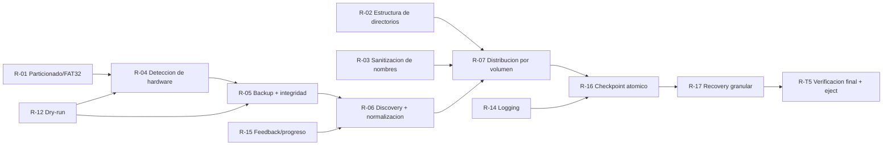
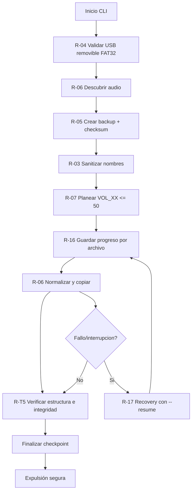
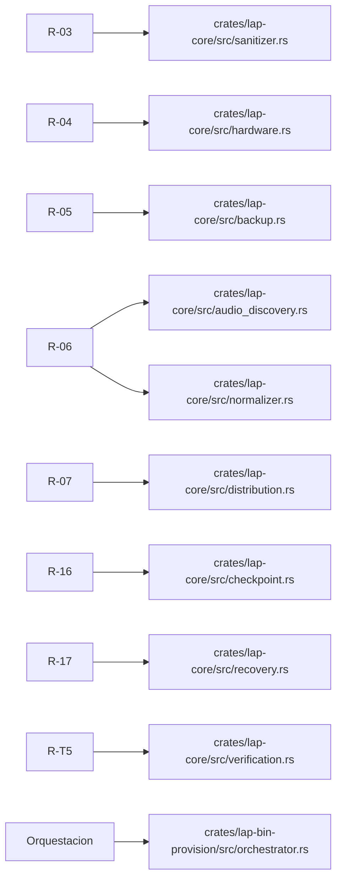
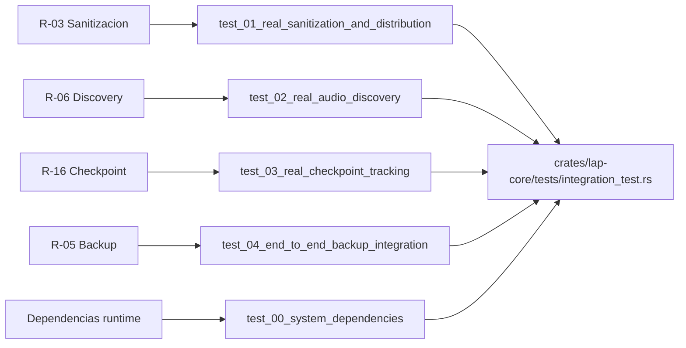
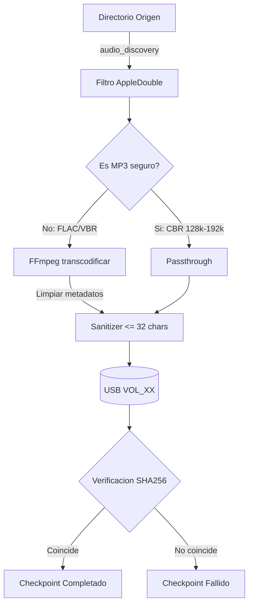
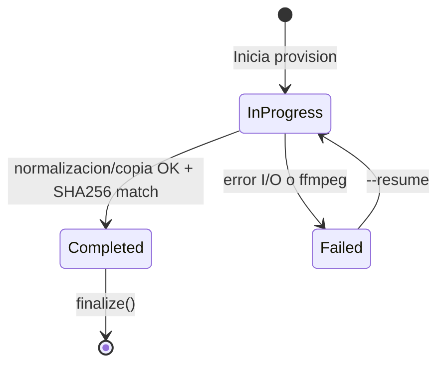
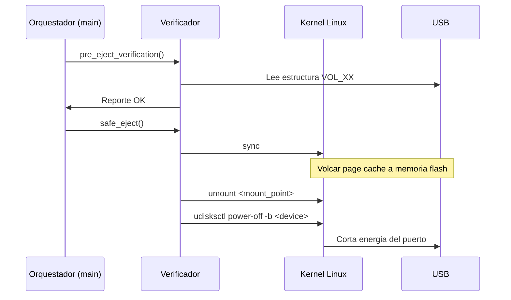
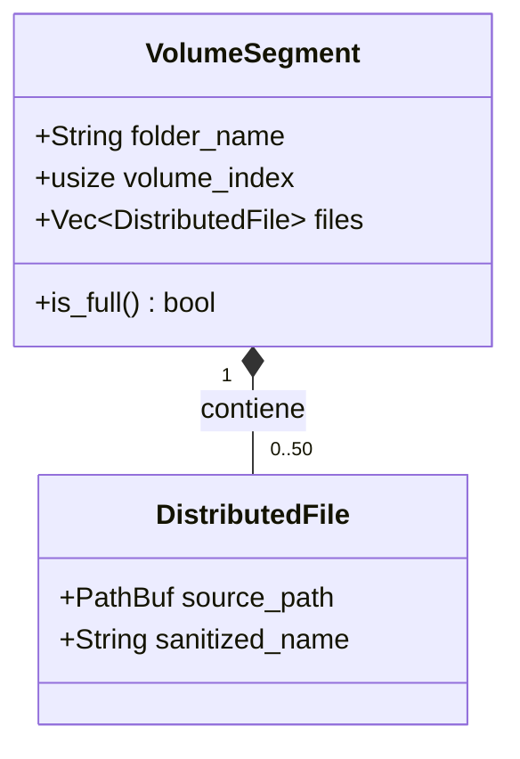

# Requisitos R-01 a R-17 - Diagramas Visuales

Este documento resume por que existen los IDs `R-01 ... R-17` y como se conectan con codigo, tests y operacion.

## 1) Mapa General De Requisitos

## 2) Flujo Operativo (Provision)

## 3) Trazabilidad Requisito -> Codigo

## 4) Trazabilidad Requisito -> Pruebas

## 5) Por Que No Se Nombra Por Archivo

- Un requisito no equivale a un archivo.
- Un requisito cruza modulos, CLI, verificacion y tests.
- Los IDs `R-XX` permiten saber que garantia se toca aunque el codigo cambie de archivo.
- Si el proyecto crece, la trazabilidad se mantiene estable.

## 6) Lectura Rapida

- Si cambias compatibilidad de nombres: impacta `R-03`.
- Si cambias como se detecta USB: impacta `R-04`.
- Si cambias reanudacion tras fallo: impacta `R-16` y `R-17`.
- Si cambias validacion final antes de expulsar: impacta `R-T5`.

## 7) Patrón Industrial Mermaid (Docs-as-Code)

Markdown puro no renderiza diagramas por si solo. En la practica, el estandar en repositorios es usar bloques `mermaid` para documentacion viva en GitHub/GitLab/VS Code.

### 7.1 Flowchart (Pipeline)

### 7.2 State Diagram (Checkpoint)

### 7.3 Sequence Diagram (Expulsión Segura)

### 7.4 Class Diagram (Planificacion en Memoria)

### 7.5 Recomendacion de Uso

- `Flowchart`: arquitectura de pipeline y decisiones de proceso.
- `State`: recovery/checkpoint y transiciones de error.
- `Sequence`: interaccion con OS y pasos de seguridad.
- `Class`: relaciones entre structs y limites en memoria.
