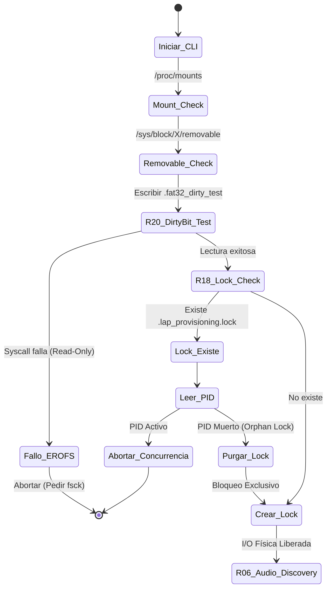

# SDD Extension: Edge Case Mitigation & Fault Tolerance

## 1. Contexto y Alcance

La arquitectura base (v1.0.0) asume un entorno físico y lógico nominal durante la ejecución. Este documento especifica los requerimientos de tolerancia a fallos de borde (Phase 2), abordando condiciones de carrera, bloqueos del kernel, estafas de hardware (NAND spoofing) y protección de derechos de autor (DRM).

El objetivo de estos requisitos es el **Fail-Fast**: detectar la anomalía antes de gastar ciclos de CPU en I/O inútil y proteger el estado transaccional.

---

## 2. Requisitos Transaccionales (R-18 a R-22)

### R-18: Exclusión Mutua Física (Concurrency Lock)

**Problema:** Ejecuciones concurrentes de la CLI corrompen la estructura `VOL_XX` y la bitácora JSON.

* **Mecanismo:** El orquestador debe intentar crear un archivo de bloqueo exclusivo `.lap_provisioning.lock` en la raíz de la USB al iniciar.
* **Contenido del Lock:** Debe almacenar el `PID` (Process ID) del proceso en ejecución.
* **Política de Rechazo:** Si el archivo existe al iniciar, el sistema lee el `PID`. Si el `PID` corresponde a un proceso activo en el OS, el sistema aborta con `CONCURRENCY_ERROR`. Si el proceso está muerto (crash previo), se considera un *lock huérfano*, se purga y se continúa.
* **Postcondición:** El archivo `.lock` se elimina atómicamente al ejecutar `safe_eject()`.

### R-19: Cuarentena de Archivos Encriptados (DRM)

**Problema:** `ffmpeg` no puede decodificar archivos con DRM (Apple Music antiguo, cachés de streaming), resultando en I/O inútil o archivos de 0 bytes.

* **Mecanismo:** El módulo `normalizer.rs` debe inspeccionar la salida del comando `ffprobe` (análisis previo) buscando metadatos de encriptación (`is_avc`, tags de DRM).
* **Política de Rechazo:** Si se detecta DRM, el archivo **no** entra al pipeline de FFmpeg.
* **Postcondición:** El archivo se marca como `Skipped_DRM` en el Checkpoint y su ruta original se vuelca en un archivo `unsupported_drm_files.log` en el directorio de backup para auditoría del usuario.

### R-20: Detección Temprana de Tabla FAT Corrupta (Dirty Bit / EROFS)

**Problema:** Extraer la USB violentamente corrompe la FAT. Linux la remonta como *Read-Only* (EROFS). El pipeline fallará en el primer `fs::copy`.

* **Mecanismo:** Antes de planificar la distribución (R-07), el orquestador debe ejecutar un *Write-Test* atómico: crear, escribir un byte y eliminar un archivo oculto `.fat32_dirty_test` en la raíz del USB.
* **Política de Rechazo:** Si la syscall retorna `EACCES` (Permiso denegado) o `EROFS` (Read-only file system), el orquestador aborta inmediatamente la provisión.
* **Postcondición:** Emitir instrucción exacta en CLI: `ERROR: Filesystem is Read-Only. Run 'sudo fsck.fat -a /dev/sdX' to repair the dirty bit.`

### R-21: Manejo Estricto de Agotamiento I/O en Host (ENOSPC)

**Problema:** El disco duro del host se llena al 100% durante el reemplazo atómico del JSON (`fs::rename`), rompiendo la transacción temporal.

* **Mecanismo:** Capturar el error `std::io::ErrorKind::StorageFull` explícitamente en el `checkpoint.rs`.
* **Política de Rechazo:** Abortar inmediatamente. El estado del archivo fallido se revierte en memoria a `InProgress`.
* **Postcondición:** El `.tmp` fallido se purga. El último `.provisioning_checkpoint` intacto prevalece.

### R-22: Umbral de Fraude de Hardware (NAND Spoofing Quarantine)

**Problema:** Una memoria flash USB falsa (sobre-reporta capacidad) pasará el test de `statvfs()`, pero los bloques físicos se sobrescribirán a sí mismos, resultando en fallos en la verificación criptográfica final.

* **Mecanismo:** El módulo de `verification.rs` (o `recovery.rs`) rastrea la cantidad de desajustes continuos de SHA256.
* **Política de Rechazo:** Si se detectan más de **5 fallos de hash consecutivos** en archivos recién escritos, el sistema asume daño físico del controlador o fraude NAND.
* **Postcondición:** Aborta todo el proceso con `HARDWARE_FRAUD_DETECTED`. Impide continuar para no seguir mutilando los datos.

---

## 3. Diagrama de Estado: Inicialización Segura (Pre-flight)

Este diagrama documenta la secuencia estricta que debe ocurrir en `main.rs` **antes** de procesar el primer archivo de audio, cubriendo R-18 y R-20.

---

## 4. Notas de Implementación

Ninguno de estos requisitos requiere reescribir la arquitectura base; todos son **filtros de pre-condición** (Pre-flight checks) y capturas de error específicas (Error Handling) que se inyectan al inicio de la ejecución o durante el bucle de validación.

La implementación inicial prioriza:
1. **R-18 (Concurrency Lock):** Protección contra ejecutables concurrentes mediante RAII
2. **R-20 (Dirty Bit Test):** Validación temprana de FAT32 write-ability
3. **R-21, R-22:** Instrumentación en bucles de validación posteriores

### Patrón Arquitectónico: RAII para Gestión de Bloqueos

En Rust, la manera arquitectónicamente superior de gestionar exclusión mutua a nivel de sistema de archivos es utilizando el patrón **RAII** (*Resource Acquisition Is Initialization*) mediante el trait `Drop`. De esta forma, el bloqueo se adquiere al instanciar una estructura, y el compilador garantiza que se liberará (se borrará el archivo) en el momento exacto en que la variable salga de ámbito, ya sea por éxito o por un error temprano, sin que tengas que acordarte de llamar a un método `release()`.

**Ventajas:**
- Auto-limpieza garantizada por el compilador de Rust
- Crash-tolerant: Locks huérfanos detectados automáticamente en el siguiente ciclo
- Composición segura: Imposible implementar el patrón de "forget to unlock"

---

## 5. Roadmap: Integración Incremental

| Requisito | Módulo | Prioridad | Estado |
|-----------|--------|-----------|--------|
| R-18 | hardware.rs, main.rs | Alta | Implementado (RAII) |
| R-20 | hardware.rs, main.rs | Alta | Planificado |
| R-19 | normalizer.rs | Media | Planificado |
| R-21 | checkpoint.rs | Media | Planificado |
| R-22 | verification.rs | Media | Planificado |
