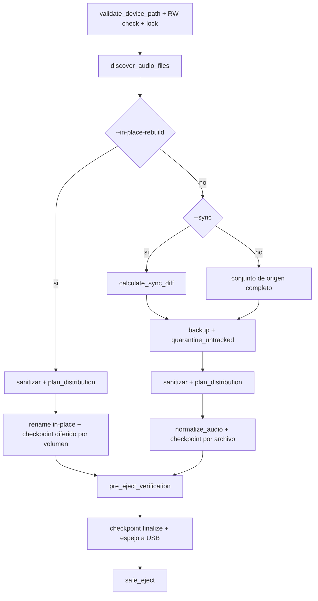

# Legacy Audio Provisioner - Tech Spec Consolidado

## Alcance
Herramienta CLI para preparar USBs compatibles con firmware legacy de audio (32-bit, FAT32 fragil) con pipeline transaccional, recuperacion granular y verificacion criptografica.

## Planteamiento del Problema
Los firmwares legacy fallan ante:
- Jerarquias profundas de directorios.
- Nombres largos/no ASCII.
- Metadatos basura del OS (dotfiles, AppleDouble, reciclaje Windows).
- Formatos/bitrate incompatibles.
- Escrituras interrumpidas sin checkpoint atomico.

## Restricciones del Sistema
- Filesystem objetivo: `vfat`/FAT32.
- Allocation unit objetivo para firmware legacy: 32 KB cuando pueda verificarse desde el boot sector FAT32.
- Directorios: maximo 2 niveles (`ROOT -> VOL_XX -> archivo`).
- Archivos por volumen: maximo 50.
- Nombre final: <= 32 caracteres ASCII.
- Escritura secuencial y sincronizacion de directorio para minimizar riesgo FAT inconsistente.

## Requisitos Funcionales
### R-03 Sanitizacion
- Eliminar caracteres no permitidos, incluyendo signos de operacion y simbolos no alfanumericos similares.
- Mantener extension de archivo.
- Prefijo secuencial (`001_`, `002_`, ...).
- Forzar `<= 32` caracteres en el nombre final.

### R-04 Validacion de hardware
- Detectar dispositivos montados desde `/proc/mounts`.
- Permitir solo `/dev/*` en FAT32 y removibles segun `/sys/block/*/removable`.
- Validar allocation unit FAT32 de 32 KB cuando el boot sector sea legible; si no puede determinarse, continuar en modo best-effort con advertencia.
- Denegar rutas locales que no correspondan a mountpoint de bloque.

### R-05 Backup + integridad
- Crear backup local de trabajo estable por dispositivo.
- Derivar identidad de estado con slug + hash corto para evitar colisiones entre dispositivos con metadatos similares.
- Verificar espacio disponible previo.
- Tratar errores de metadata en preflight como fallos bloqueantes (no best-effort silencioso).
- Calcular y verificar checksums en backup.
- En `--in-place-rebuild`, preservar arbol relativo del mount USB en el backup (no backup plano por nombre).

### R-06 Discovery + normalizacion
- Escaneo recursivo con poda temprana de entradas ocultas/sistema.
- Soporte de extensiones de audio definidas.
- Modo estandar: normalizacion via ffmpeg/ffprobe en escritura fisica para salida MP3 compatible.
- Lectura explicita via ffprobe de streams/tags para detectar portadas embebidas (ID3/APIC/covr) antes de purga.
- Modo `--in-place-rebuild`: no hay transcodificacion; se aplica solo reindexado topologico y renombrado en el mismo filesystem via `std::fs::rename`.

### R-07 Distribucion
- Planificador puro en memoria que agrupa en `VOL_XX` de 50 archivos maximo.
- La escritura fisica se hace solo en el orquestador principal.

### R-23 Sync incremental
- Modo `--sync` con diff SHA256 entre origen y USB.
- El calculo SHA256 se centraliza en `lap-core::crypto::compute_file_sha256` para evitar duplicacion.
- El host opera como fuente de verdad mediante estado en `~/.lap` (checkpoints/manifests/journals por device key).
- Continuidad de indices globales: nuevos archivos empiezan en `N+1` sin colisiones.
- Relleno del ultimo volumen parcial antes de abrir nuevo `VOL_XX`.

### R-33 Base i18n runtime (minima)
- Selector de idioma por CLI: `--lang es|en` (global).
- Fallback por entorno: `LAP_LANG`.
- Primer alcance: mensajes runtime clave del binario/orquestador migrados a seleccion `es/en`.
- No incluye localizacion completa de texto estatico de ayuda en esta fase.

### R-01-006 EntryPoint delgada + Orquestacion
- El binario CLI (`main`) solo inicializa logging/runtime, parsea comandos y delega.
- El flujo de negocio vive en `ProvisioningOrchestrator` para preservar SRP y facilitar evolucion.

### R-01-007 Abstraccion de progreso
- El avance operativo se reporta via trait `ProgressReporter`.
- Implementaciones actuales: `CliReporter` (indicatif) y `JsonIpcReporter`.
- La logica de provisionamiento no depende de salida de terminal concreta.

### R-25/R-26 Cuarentena de untracked
- Archivos no rastreados en USB se aislan en `.legacy_quarantine/<session>`.
- Flujo backup-first: primero copia a host, luego movimiento en USB.
- Politica por defecto no destructiva (sin purga automatica).

### R-30 Validacion de paths canonicos
- `--usb` y `--source` no pueden ser el mismo path fisico.
- El origen de audio no puede estar anidado dentro del mount de destino USB.
- Resolucion mediante `std::fs::canonicalize()` antes de iniciar el pipeline (pre-flight).
- Fallo anticipado con `ProvisioningError::InvalidConfig` y codigo IPC `INVALID_CONFIG`.
- Excepcion explicita: en `--in-place-rebuild`, `--source` debe resolver al mismo mount que `--usb`.

### R-31 Ingesta local en Host Storage (staging)
- La refactorizacion in-situ debe copiar audio desde USB/origen hacia un area de staging en almacenamiento local del host.
- El staging es agnostico al hardware: puede residir en HDD, SSD, NVMe o RAM-disk.
- La ingesta es solo copia: no mueve ni borra origen durante la extraccion.
- Debe mantenerse trazabilidad `source -> staging` con hash SHA256 por archivo.
- La mutacion de la USB (cuarentena + escritura normalizada) ocurre unicamente en la fase de provision posterior.
- Este requisito no aplica cuando se ejecuta `--in-place-rebuild`.

### R-15 Feedback visual
- Barra de progreso con ETA durante el paso de normalizacion/copia.

### R-16 Checkpoint atomico
- Estado por archivo en `BTreeMap<usize, FileCheckpoint>`.
- Persistencia atomica `tmp -> sync_all -> rename`.
- Politica de flush en `--in-place-rebuild`: actualizar estado por archivo en memoria y persistir a disco al cierre de cada volumen (`50` archivos) o al final de la ejecucion.

### R-17 Recuperacion
- Reanudacion con `--resume <backup_dir>`.
- Reintento granular de faltantes/corruptos usando normalizador.
- Backfill de checksums legacy invalidos.

### R-T5 Verificacion final + expulsado seguro
- Auditoria de topologia en USB (VOL_XX, 50 maximo, ASCII, 32 chars).
- Verificacion SHA256 contra checkpoint para entradas `Completed`.
- En Linux: `sync` antes de `umount` y `udisksctl power-off`.

### Contrato de errores e IPC
- Errores de dominio en `ProvisioningError` (`ENOSPC_ERROR`, `HARDWARE_FRAUD_DETECTED`, etc.).
- Eventos JSON en `ipc::IpcEvent`: `PROGRESS`, `WARNING`, `FATAL_ERROR`, `SUCCESS`.
- El reporte de progreso humano/CLI se desacopla del IPC via `ProgressReporter`.

## Arquitectura Actual (Implementacion)

### Pipeline de Provision (Visual)



### Bucle de Fallo/Recuperacion (Visual)

```mermaid
stateDiagram-v2
	[*] --> EnProgreso
	EnProgreso --> Completado: archivo normalizado + hash validado
	EnProgreso --> Fallido: error de io/codec/fs
	Fallido --> Reanudar: --resume
	Reanudar --> EnProgreso: recovery::execute_recovery
	Completado --> Finalizado: checkpoint.finalize
	Finalizado --> [*]
```

Pipeline de provision:
1. `main` parsea CLI y delega a `ProvisioningOrchestrator`
2. `hardware::validate_device_path`
3. branch por modo:
	- `--in-place-rebuild`: `InPlaceTransformer::build_plan` + `std::fs::rename` (sin ffmpeg, sin staging)
	- modo estandar: `audio_discovery::discover_audio_files` y, si aplica, `diffing::calculate_sync_diff`
4. modo estandar: `backup` + validacion espacio/checksum
5. modo estandar: cuarentena con backup-first de no rastreados (`diffing::quarantine_untracked_files`, si aplica)
6. sanitizacion + `distribution::plan_distribution` (o incremental)
7. aplicacion fisica:
	- in-place: renombrado en el mismo mount FAT32
	- estandar: normalizacion fisica + copia
8. checkpoint:
	- in-place: persistencia diferida por volumen de 50
	- estandar: persistencia por archivo
9. `verification::pre_eject_verification`
10. `checkpoint.finalize` en estado host-only (`~/.lap/checkpoints/<device_key>/`)
11. `verification::safe_eject`

Pipeline de refactorizacion in-situ (R-31):
1. ingesta copy-only hacia staging en host local
2. provision desde staging hacia USB (`--sync` recomendado)
3. cleanup opcional del staging local

Pipeline de recuperacion:
1. `checkpoint::load_from_disk`
2. evaluar `is_recoverable`
3. `recovery::execute_recovery`
4. terminar cuando hashes y estado convergen

## CLI Operacional
- `list`
- `scan [--usb <PATH>]`
- `ingest --usb <PATH> --source <PATH>`
- `provision --usb <PATH> --source <PATH>`
- `provision --usb <PATH> --source <PATH> --sync`
- `provision --usb <PATH> --source <PATH> --in-place-rebuild`
- `refactor --usb <PATH> --source <PATH> [--keep-staging]`
- `resume --usb <PATH> --resume <BACKUP_DIR>`
- `provision ... --dry-run`
- `--json` (global)

## Requisitos No Funcionales
- Seguridad: denegar targets no removibles/no FAT32.
- Durabilidad: operaciones atomicas y sync explicito.
- Observabilidad: logs + barra de progreso.
- Mantenibilidad: docs-as-code, ADRs y contratos de modulo.

## Perfil de Build Release
Definido en `Cargo.toml`:
- `opt-level = 3`
- `lto = true`
- `codegen-units = 1`
- `panic = "abort"`
- `strip = true`

## Gobernanza Documental
Este archivo se considera fuente de verdad de alto nivel. Cambios arquitectonicos deben enlazar al ADR correspondiente en `docs/adr/` (canonico).

Lista minima de sincronizacion documental por cambio funcional:

- ADR nuevo o supercedido (si cambia decision).
- Actualizacion de esta especificacion tecnica (si cambia flujo/reglas).
- Actualizacion de `docs/testing/*` (si cambia cobertura o pruebas).
