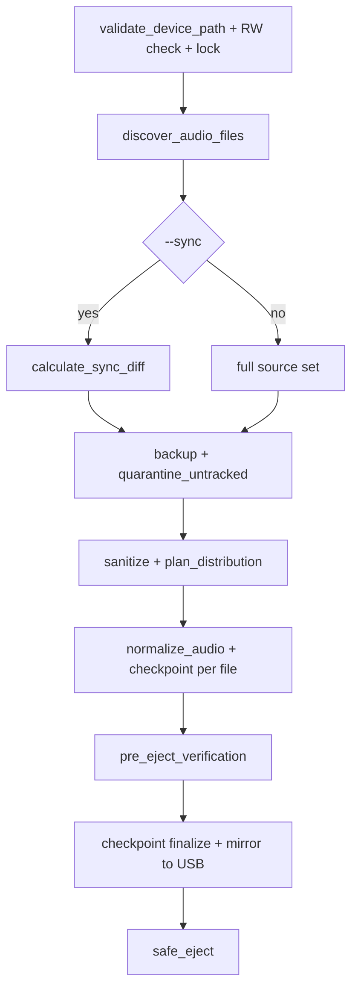

# Legacy Audio Provisioner - Tech Spec Consolidado

## Scope
Herramienta CLI para preparar USBs compatibles con firmware legacy de audio (32-bit, FAT32 fragil) con pipeline transaccional, recovery granular y verificacion criptografica.

## Problem Statement
Los firmwares legacy fallan ante:
- Jerarquias profundas de directorios.
- Nombres largos/no ASCII.
- Metadatos basura del OS (dotfiles, AppleDouble, reciclaje Windows).
- Formatos/bitrate incompatibles.
- Escrituras interrumpidas sin checkpoint atomico.

## System Constraints
- Filesystem objetivo: `vfat`/FAT32.
- Directorios: maximo 2 niveles (`ROOT -> VOL_XX -> archivo`).
- Archivos por volumen: maximo 50.
- Nombre final: <= 32 caracteres ASCII.
- Escritura secuencial y sincronizacion de directorio para minimizar riesgo FAT inconsistente.

## Functional Requirements
### R-03 Sanitizacion
- Eliminar caracteres no permitidos.
- Mantener extension de archivo.
- Prefijo secuencial (`001_`, `002_`, ...).
- Enforce `<= 32` caracteres en el nombre final.

### R-04 Validacion de hardware
- Detectar dispositivos montados desde `/proc/mounts`.
- Permitir solo `/dev/*` en FAT32 y removibles segun `/sys/block/*/removable`.
- Denegar rutas locales que no correspondan a mountpoint de bloque.

### R-05 Backup + integridad
- Crear backup local de trabajo con timestamp.
- Verificar espacio disponible previo.
- Calcular y verificar checksums en backup.

### R-06 Discovery + normalizacion
- Escaneo recursivo con poda temprana de entradas ocultas/sistema.
- Soporte de extensiones de audio definidas.
- Normalizacion via ffmpeg/ffprobe en escritura fisica para salida MP3 compatible.

### R-07 Distribucion
- Planificador puro en memoria que agrupa en `VOL_XX` de 50 archivos maximo.
- La escritura fisica se hace solo en el orquestador principal.

### R-23 Sync incremental
- Modo `--sync` con diff SHA256 entre origen y USB.
- La USB opera como fuente de verdad mediante `.provisioning_checkpoint` espejado.
- Continuidad de indices globales: nuevos archivos empiezan en `N+1` sin colisiones.
- Relleno del ultimo volumen parcial antes de abrir nuevo `VOL_XX`.

### R-25/R-26 Cuarentena de untracked
- Archivos no rastreados en USB se aislan en `.legacy_quarantine/<session>`.
- Flujo backup-first: primero copia a host, luego movimiento en USB.
- Politica por defecto no destructiva (sin purga automatica).

### R-15 Feedback visual
- Barra de progreso con ETA durante el paso de normalizacion/copia.

### R-16 Checkpoint atomico
- Estado por archivo en `BTreeMap<usize, FileCheckpoint>`.
- Persistencia atomica `tmp -> sync_all -> rename`.

### R-17 Recovery
- Reanudacion con `--resume <backup_dir>`.
- Reintento granular de faltantes/corruptos usando normalizador.
- Backfill de checksums legacy invalidos.

### R-T5 Verificacion final + expulsado seguro
- Auditoria de topologia en USB (VOL_XX, 50 maximo, ASCII, 32 chars).
- Verificacion SHA256 contra checkpoint para entradas `Completed`.
- En Linux: `sync` antes de `umount` y `udisksctl power-off`.

### Contrato de errores e IPC
- Errores de dominio en `ProvisioningError` (`ENOSPC_ERROR`, `HARDWARE_FRAUD_DETECTED`, etc.).
- Eventos JSON en `ipc::IpcEvent`: `PROGRESS`, `WARNING`, `FATAL_ERROR`, `SUCCESS`.

## Current Architecture (Implementation)

### Provision Pipeline (Visual)



### Failure/Recovery Loop (Visual)

```mermaid
stateDiagram-v2
	[*] --> InProgress
	InProgress --> Completed: file normalized + hash validated
	InProgress --> Failed: io/codec/fs error
	Failed --> Resume: --resume
	Resume --> InProgress: recovery::execute_recovery
	Completed --> Finalized: checkpoint.finalize
	Finalized --> [*]
```

Pipeline de provision:
1. `hardware::validate_device_path`
2. `audio_discovery::discover_audio_files`
3. `diffing::calculate_sync_diff` (si `--sync`)
4. `backup` + validacion espacio/checksum
5. cuarentena backup-first de untracked (`diffing::quarantine_untracked_files`, si aplica)
6. sanitizacion + `distribution::plan_distribution` o `diffing::plan_incremental_distribution`
7. normalizacion fisica + `checkpoint` por archivo + progress bar
8. `verification::pre_eject_verification`
9. `checkpoint.finalize` + mirror checkpoint a USB
10. `verification::safe_eject`

Pipeline de recovery:
1. `checkpoint::load_from_disk`
2. evaluar `is_recoverable`
3. `recovery::execute_recovery`
4. terminar cuando hashes y estado convergen

## Operational CLI
- `--list-devices`
- `--scan-usb-audio`
- `--usb-mount <PATH> --audio-source <PATH>`
- `--usb-mount <PATH> --audio-source <PATH> --sync`
- `--usb-mount <PATH> --resume <BACKUP_DIR>`
- `--dry-run`
- `--json`

## Non-Functional Requirements
- Seguridad: denegar targets no removibles/no FAT32.
- Durabilidad: operaciones atomicas y sync explicito.
- Observabilidad: logs + barra de progreso.
- Mantenibilidad: docs-as-code, ADRs y contratos de modulo.

## Release Build Profile
Definido en `Cargo.toml`:
- `opt-level = 3`
- `lto = true`
- `codegen-units = 1`
- `panic = "abort"`
- `strip = true`

## Document Governance
Este archivo se considera fuente de verdad de alto nivel. Cambios arquitectonicos deben enlazar al ADR correspondiente en `docs/adr/` (canonico).

Checklist minimo de sincronizacion documental por cambio funcional:

- ADR nuevo o supercedido (si cambia decision).
- Actualizacion de este Tech Spec (si cambia flujo/reglas).
- Actualizacion de `docs/testing/*` (si cambia cobertura o pruebas).
