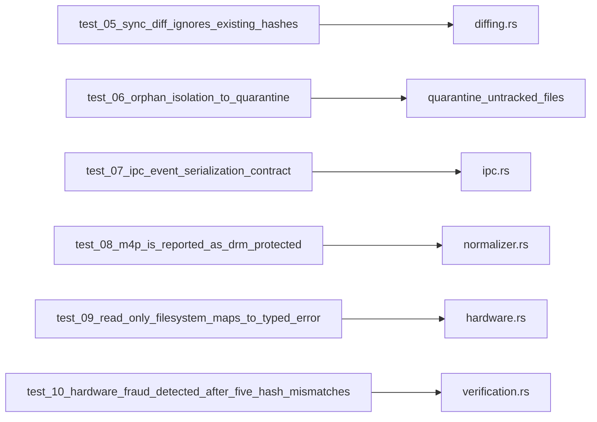

# Pruebas de Integración - Legacy Audio Provisioner

**Fecha**: 16 de Marzo de 2026
**Estado**: ✅ COMPLETO — 24 pruebas de integración + 55 pruebas unitarias + 2 doc tests = **81/81 EXITOSAS**

## Objetivo

Validar el comportamiento integrado del motor sobre los flujos críticos de Fase 2:

- sincronización incremental por hash,
- cuarentena no destructiva de huérfanos,
- contrato IPC JSON,
- errores tipados para condiciones de fallo realistas,
- invariantes legacy de nombres, volúmenes y topología.

## Resumen de la Suite

| Prueba | IDs de Requisito (`R-CC-NNN`) | Tipo de Evidencia | Propósito | Estado |
|---|---|---|---|---|
| `test_00_system_dependencies` | `R-20-001` | Puerta de entorno | Verifica presencia de `ffmpeg` en entorno | ✅ PASS |
| `test_01_real_sanitization_and_distribution` | `R-02-008`, `R-08-001`, `R-09-009` | Invariante / nominal | Sanitización + distribución 50/volumen | ✅ PASS |
| `test_02_real_audio_discovery` | `R-02-004` | Filtro negativo / entrada hostil | Filtrado AppleDouble y carpetas ocultas | ✅ PASS |
| `test_03_real_checkpoint_tracking` | `R-09-007` | Persistencia de estado | Checkpoint atómico con progreso | ✅ PASS |
| `test_04_end_to_end_backup_integration` | `R-06-004` | Integridad / nominal | Backup + SHA256 en flujo real | ✅ PASS |
| `test_05_sync_diff_ignores_existing_hashes` | `R-06-001`, `R-09-005` | Integridad / diferencial | Diff incremental: omisión de archivos existentes por hash | ✅ PASS |
| `test_06_orphan_isolation_to_quarantine` | `R-09-006` | Protección negativa | Cuarentena backup-first en `.legacy_quarantine/` | ✅ PASS |
| `test_07_ipc_event_serialization_contract` | `R-01-002` | Contrato | Contrato estructural JSON de `IpcEvent` | ✅ PASS |
| `test_08_m4p_is_reported_as_drm_protected` | `R-08-005` | Negativo / medio hostil | DRM tipado (`DRM_PROTECTED`) para `.m4p` | ✅ PASS |
| `test_09_read_only_filesystem_maps_to_typed_error` | `R-02-002` | Inyección de fallos | Dirty-bit/read-only -> `FILESYSTEM_READ_ONLY` | ✅ PASS |
| `test_10_hardware_fraud_detected_after_five_hash_mismatches` | `R-02-007` | Inyección de fallos | Detección de fraude NAND -> `HARDWARE_FRAUD_DETECTED` | ✅ PASS |
| `test_11_path_traversal_is_rejected` | `R-05-001` | Adversarial | Rechaza `../escape.mp3` fuera de la jaula de ruta | ✅ PASS |
| `test_12_shell_injection_filename_is_rejected` | `R-05-002` | Adversarial | Rechaza metacaracteres shell (`; rm -rf /`) | ✅ PASS |
| `test_13_metadata_bomb_is_rejected` | `R-05-003` | Adversarial | Rechaza payload de metadata > 5MB | ✅ PASS |
| `test_14_preflight_rw_probe_fails_fast_on_read_only_target` | `R-02-005` | Inyección de fallos | Pre-flight `.fat32_dirty_test` aborta antes del pipeline sobre target read-only | ✅ PASS |
| `test_15_checkpoint_enospc_maps_to_storage_full` | `R-02-006` | Inyección de fallos | Escritura atómica del checkpoint mapea ENOSPC a `ENOSPC_ERROR` | ✅ PASS |
| `test_16_session_log_is_created_with_json_entries` | `R-01-005` | Integración / observabilidad | Crea log estructurado por dispositivo (o por operación en fallback) con entradas JSON válidas | ✅ PASS |
| `test_17_execute_recovery_restores_only_invalid_entries` | `R-09-008` | Integración / recuperación | Reanuda desde checkpoint, recupera solo la entrada inválida y preserva la válida | ✅ PASS |
| `test_18_pre_eject_verification_accepts_valid_topology_and_hashes` | `R-09-010` | Integración / subconjunto de verificación | Valida topología `VOL_XX` e integridad SHA256 antes del eject | ✅ PASS |
| `test_19_verify_file_integrity_detects_post_write_corruption` | `R-06-002` | Integración / criptografía | Acepta archivo íntegro; detecta hash mismatch tras corrupción post-escritura | ✅ PASS |
| `test_20_root_topology_sweep_prevents_pre_eject_false_positives` | `R-09-011`, `R-09-010` | Integración / flujo orquestado de saneamiento | Ejecuta barrido raíz no-whitelist + cuarentena backup-first previo a `pre_eject_verification` y valida salida sin errores | ✅ PASS |
| `test_21_json_ingest_emits_only_machine_readable_events` | `R-01-007` | Integración / contrato de reportería | Verifica que `--json ingest` emite solo eventos parseables (`PROGRESS`, `SUCCESS`) | ✅ PASS |
| `test_22_json_scan_unsupported_feature_returns_typed_fatal_error` | `R-01-006` | Integración / entrypoint y dispatch | Verifica manejo de feature no soportada con `FATAL_ERROR` tipado (`UNSUPPORTED_JSON_MODE`) | ✅ PASS |
| `test_23_in_place_e2e_applies_fast_and_slow_paths` | `R-09-004`, `R-08-006`, `R-02-008` | E2E / orquestación funcional en FS real temporal | Ejecuta rebuild in-place (plan + ejecución), valida topología `VOL_XX`, nombres <=32, hash inmutable en ruta rápida y limpieza de metadatos en ruta lenta | ✅ PASS |

## Cobertura por componente

| Componente | Cobertura de integración |
|---|---|
| `sanitizer.rs` | nombres ASCII, longitud <=32, extensión preservada |
| `distribution.rs` | segmentación `VOL_XX` con límite 50 |
| `audio_discovery.rs` | exclusión de `._*`, `.Trash`, ruido de sistema |
| `checkpoint.rs` | persistencia y progreso por archivo |
| `backup.rs` | copia y verificación SHA256 |
| `diffing.rs` | diff por hash + cuarentena backup-first |
| `ipc.rs` | serialización de eventos (`PROGRESS`, etc.) |
| `normalizer.rs` | detección tipada de DRM por extensión/inspección |
| `hardware.rs` | mapeo de fs read-only a error tipado |
| `verification.rs` | fraude de hardware por mismatches SHA256 consecutivos |
| `security.rs` | validación adversarial de path jail, shell sanitizer y metadata sandbox |
| `checkpoint.rs` | mapeo con fallos inyectados de ENOSPC en persistencia atómica |
| `lap-bin-provision` | log estructurado por sesión con registros JSON-lines |
| `recovery.rs` | recuperación granular que repara solo entradas inválidas del checkpoint |
| `in_place_transformer.rs` + `normalizer.rs` | reconstrucción in-place con bifurcación fast/slow path y validación de invariantes de salida |

## Trazabilidad Visual



## Puerta de QA para `VERIFIED`

- Un requisito solo puede pasar a `VERIFIED` si su evidencia aparece en la tabla anterior.
- Para categorías `02` (Hardware) y `05` (Seguridad), la evidencia debe ser negativa, adversarial o con fallos inyectados; una ruta nominal por sí sola no es suficiente.
- Los requisitos `R-05-*` cuentan con evidencia adversarial explícita en `test_11`, `test_12` y `test_13`.

## Línea Base de Cobertura

```text
Unit tests:         55
Pruebas de integración:  24
 Doc tests:           2
 --------------------------------
TOTAL:               81/81 EXITOSAS
```

## Ejecutar la suite

```bash
# Todo
cargo test

# Solo integración
cargo test -p lap-core --test integration_test

# Integración con logs
cargo test -p lap-core --test integration_test -- --nocapture
```

## Notas de diseño

- Los tests de integración usan APIs reales del crate (sin mocks de lógica core).
- El aislamiento se realiza con `tempfile::TempDir` para no contaminar el host.
- La cobertura de errores tipados asegura frontera estable para frontend IPC.

## Estado documental

`docs/testing/integration_tests.md` está alineado con el estado actual del repositorio y debe actualizarse junto con cualquier cambio en `crates/lap-core/tests/integration_test.rs` o `crates/lap-bin-provision/tests/structured_logging_test.rs`.
